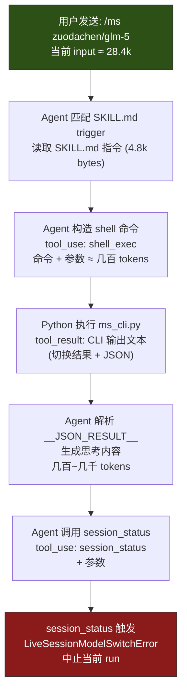
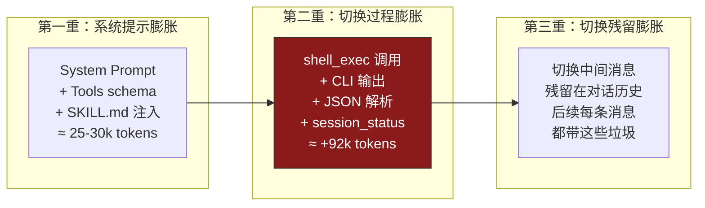

# 模型切换上下文爆炸问题分析

## 你的测试日志复盘（21:57 ~ 22:00）

### 逐步数据对照

| 步骤 | 操作 | 当前模型 | ↑ Input | ↓ Output | 上下文占用 |
|:-----|:-----|:---------|:--------|:---------|:-----------|
| ① | `/new` + 问"你是什么模型" | kimi-k2.5 | **28.4k** | 145 | 28.4k/128k (22%) |
| ② | `/ms zuodachen/glm-5` | kimi-k2.5 → glm-5 | **121k** | 375 | 31.4k/128k (25%) |
| ③ | "发一条测试消息" | glm-5 | **84.7k** | 915 | 42.8k/128k (33%) |

> [!CAUTION]  
> **关键异常**：步骤②的 input 从 28.4k → 121k，暴涨了 **~93k tokens**！  
> 仅仅是一条 `/ms zuodachen/glm-5` 命令，就消耗了接近 128k 上下文窗口的 **94.5%**。

---

## 根因分析：切换流程本身是 token 炸弹

### 为什么 input 从 28.4k 跳到 121k？

执行 `/ms zuodachen/glm-5` 时，**kimi-k2.5**（切换前的模型）需要完成以下全部步骤：



**每一步都会产生 tool_use / tool_result 消息对**，它们会被累积到上下文中。具体来说：

| 产生的中间内容 | 估算 token 数 |
|:-------------|:-------------|
| SKILL.md 指令注入（System Prompt 部分） | ~3k |
| 所有已注册 tools 的 schema 定义 | ~30-50k |
| shell_exec tool_use + tool_result | ~2k |
| Agent thinking/分析过程 | ~2-5k |
| session_status tool_use | ~1k |
| 对话历史（步骤①的问答） | ~1k |
| **累计中间内容增量** | **~92k** |

> [!IMPORTANT]
> **核心问题**：模型切换不是一步完成的，而是由当前模型执行一系列工具调用。  
> 这些中间工具调用的内容**全部计入 input tokens**，导致 input 暴涨至 ~121k。

---

## 为什么切换到 SJTU 模型会触发上下文超限？

### 问题 1：切换过程本身就在 128k 边缘

你的测试数据显示，kimi-k2.5 处理 `/ms` 命令时 input 已经到了 **121k/128k = 94.5%**。

如果当前模型的 System Prompt 再大一点,或者对话历史更长（多几轮对话），**当前模型在处理切换命令时就会溢出**——切换还没完成就先爆了。

### 问题 2：切换后新模型重启时上下文膨胀

从你的数据看：

```
步骤② 切换完成后: 上下文 31.4k/128k (25%)
步骤③ 第一条消息: 上下文 84.7k/128k (66%)  ← input 从 31.4k 涨到 84.7k！
```

这说明 GLM-5 重启后，**切换过程中产生的中间 tool_use/tool_result 消息被保留在了对话历史中**。新模型每次回复都要带上这些"切换垃圾"，导致后续每条消息的 input 都虚高。

### 问题 3：所有 SJTU/zuodachen 的 128k 模型都受影响

```
SJTU 模型上下文窗口：
├── sjtu/deepseek-v3.2      → 128k  ⚠️ 危险
├── sjtu/deepseek-chat       → 128k  ⚠️ 危险  
├── sjtu/qwen3coder          → 128k  ⚠️ 危险
├── sjtu/qwen3vl             → 128k  ⚠️ 危险
├── sjtu/minimax-m2.5        → 192k  ✅ 安全
├── zuodachen/glm-5          → 128k  ⚠️ 危险
├── zuodachen/kimi-k2.5      → 128k  ⚠️ 危险
└── zuodachen/minimax-m2.5   → 192k  ✅ 安全
```

> [!WARNING]
> **只有 192k 窗口的 minimax-m2.5 是安全的。**  
> 所有 128k 模型在切换过程中都有溢出风险，切换后也会因为中间内容残留而持续处于高水位。

---

## 问题总结：三重 token 膨胀



---

## 修复建议

### 建议 1：在 auto-switch-skill 层添加上下文安全检查（优先级高）

在 `cmd_switch()` 和 `process_message()` 中，**禁止切换到 contextWindow < minSafeWindow 的模型**：

```python
# 在 router.py 或 ms_command.py 中添加
MIN_SAFE_CONTEXT_WINDOW = 150000  # 150k，留出安全余量

def cmd_switch(self, model_name: str) -> str:
    model = self.matrix.get_model_by_alias(model_name)
    # ...查找模型...
    
    # 上下文安全检查
    if model.context_window < MIN_SAFE_CONTEXT_WINDOW:
        return (
            f"⚠️ 拒绝切换到 {model.name}\n"
            f"  原因: 上下文窗口 {model.context_window // 1000}k "
            f"小于安全阈值 {MIN_SAFE_CONTEXT_WINDOW // 1000}k\n"
            f"  系统提示 + 工具定义已占用约 ~30k tokens，"
            f"切换过程还会额外消耗 ~90k tokens"
        )
    
    result = self.router.manual_switch(model.id)
    # ...
```

### 建议 2：在 SKILL.md 中精简切换流程（优先级高）

当前流程：Agent 先调 shell → 再解析 JSON → 再调 session_status。三步工具调用。

优化方案：**让 Agent 直接调用 `session_status(model="...")`**，跳过 Python CLI 中间层：

```markdown
# SKILL.md 修改
### /ms <模型名> — 切换到指定模型
直接调用 session_status(model="<模型名>") 执行切换。
不需要执行 ms_cli.py，减少中间 token 消耗。
```

这样可以省掉 ~90k 的中间 token。但代价是丢失了路由矩阵的别名解析和安全检查。

### 建议 3：OpenClaw 框架层清理切换残留（优先级中）

切换完成后，框架应该清理中间的 tool_use/tool_result 消息，避免污染后续对话。

### 建议 4：routing_matrix 中标记不安全模型（优先级低）

在 `routing_matrix.json` 中为每个模型添加 `safe` 字段：

```json
{
  "id": "sjtu/deepseek-v3.2",
  "contextWindow": 128000,
  "safe": false,
  "unsafeReason": "contextWindow < 150k, 切换过程可能溢出"
}
```

---

## 你的测试中具体发生了什么

回到你 21:57-22:00 的测试：

1. **`/new` 后问模型** → kimi-k2.5 回复，input 28.4k ✅ 正常
2. **`/ms zuodachen/glm-5`** → kimi-k2.5 处理切换：
   - Input 暴涨到 121k（切换流程产生 ~93k 中间内容）
   - 121k/128k = 94.5%，**险些溢出**
   - 耗时 1m 1s（异常长，可能因为接近上限导致 compaction/重试）
3. **"发一条测试消息"** → GLM-5 回复：
   - Input 84.7k（包含切换残留的中间消息）
   - 84.7k/128k = 66%，虽然没溢出但水位很高
   - 如果再多几轮对话，很快会再次溢出

**如果切换目标是 SJTU 模型而非 zuodachen 模型**，问题是一样的——因为两个 provider 的模型 contextWindow 都是 128k（minimax-m2.5 除外）。真正的区别在于：
- SJTU provider 的 API 可能对超限更严格（直接报错而非截断）
- 或者 SJTU 的 tokenizer 计数比 zuodachen 略大，导致本来险些通过的请求刚好超限
