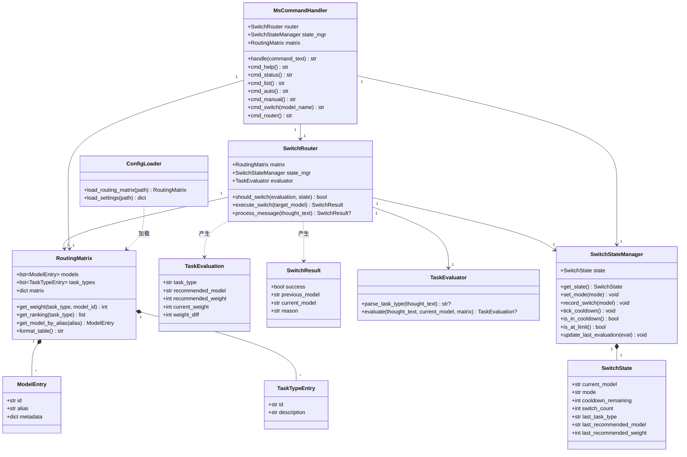

# Auto-Switch-Skill MVP 技术设计文档

> **版本**：v1.0  
> **日期**：2026-04-06  
> **对应需求**：`requirements_mvp.md` MVP v1.0  
> **用途**：供开发人员实现的详细技术设计，包含目录结构、类架构、各模块接口定义与实现指南  

---

## 文档目录

1. [系统概述](#1-系统概述)
2. [源码目录结构设计](#2-源码目录结构设计)
3. [类架构设计](#3-类架构设计)
4. [模块详细设计](#4-模块详细设计)
   - 4.1 [路由矩阵自动生成器 `generate_matrix.py`](#41-路由矩阵自动生成器)
   - 4.2 [任务类型解析器 `evaluator.py`](#42-任务类型解析器)
   - 4.3 [运行时状态管理 `state.py`](#43-运行时状态管理)
   - 4.4 [路由引擎 `router.py`](#44-路由引擎)
   - 4.5 [命令解析器 `ms_command.py`](#45-命令解析器)
   - 4.6 [Skill 入口文件 `SKILL.md`](#46-skill-入口文件)
5. [测试策略与验收标准](#5-测试策略与验收标准)
6. [附录](#6-附录)

---

## 1. 系统概述

### 1.1 核心目标

Auto-Switch-Skill 是 OpenClaw 多智能体系统中的一个 Skill 插件。MVP 阶段实现一个最小闭环：

```
用户发消息 → 模型自评估任务类型 → 查路由矩阵 → 直接阈值判定 → 执行模型切换
```

同时提供 `/ms` 命令让用户手动查看状态和切换模型。

### 1.2 技术栈

| 组件 | 技术 |
|:-----|:-----|
| 语言 | Python 3.11+ |
| 数据格式 | YAML（配置文件）、dataclass（运行时） |
| 运行环境 | OpenClaw 容器（`research-multi-agent`） |
| 模型切换 API | `session_status(model="目标模型")` |
| 外部依赖 | `PyYAML`、`re`（标准库） |

### 1.3 核心约束

| 约束 | 说明 |
|:-----|:-----|
| 冷却期 | 切换后 3 轮不再评估（硬编码） |
| 切换上限 | 单会话最多 30 次 |
| 权重差阈值 | 默认 15，推荐模型权重 - 当前模型权重 > 15 才切换 |
| 状态持久化 | 不持久化，会话级内存即可 |

### 1.4 已有代码基础

| 文件 | 状态 | 说明 |
|:-----|:-----|:-----|
| `src/config/schema.py` | ✅ 已存在 | 完整的数据模型定义（`ModelEntry`、`RoutingMatrix` 等） |
| `docs/model_profiles.yaml` | ✅ 已存在 | 70+ 模型的能力画像库 |
| 其余文件 | ❌ 待创建 | 详见下文 |

> **重要**：`schema.py` 中已包含完整版的 `DampingConfig`、`InertiaConfig`、`ContextConfig` 等类。  
> MVP 阶段 **不使用** 这些类，但无需删除。MVP 仅使用 `ModelEntry`、`TaskTypeEntry`、`RoutingMatrix`、`EvaluatorConfig` 和 `AutoSwitchConfig` 中的 `enabled` 字段。

---

## 2. 源码目录结构设计

### 2.1 MVP 完整目录树

```
auto-switch-skill/
├── SKILL.md                                # OpenClaw Skill 入口（命令匹配 + System Prompt 注入）
├── README.md                               # 项目说明（已存在）
├── LICENSE                                 # MIT 许可证（已存在）
│
├── config/                                 # 运行时配置目录（Skill 安装后生效）
│   ├── model_profiles.yaml                 # 内置画像库（从 docs/ 复制，随 repo 分发）
│   ├── routing_matrix.yaml                 # ← 由 generate_matrix.py 自动生成
│   └── settings.yaml                       # 运行时配置（阈值、冷却轮数等）
│
├── scripts/                                # 独立脚本目录
│   └── generate_matrix.py                  # 路由矩阵自动生成器（可独立运行）
│
├── src/                                    # 核心源码
│   ├── __init__.py                         # 包入口（已存在）
│   ├── config/                             # 配置管理子模块
│   │   ├── __init__.py                     # 导出（已存在，需适配）
│   │   ├── schema.py                       # 数据模型定义（已存在，无需修改）
│   │   └── loader.py                       # ← 新建：YAML 配置加载器
│   ├── core/                               # 核心业务逻辑子模块
│   │   ├── __init__.py                     # ← 新建：导出核心类
│   │   ├── evaluator.py                    # ← 新建：任务类型解析器
│   │   ├── state.py                        # ← 新建：运行时状态管理
│   │   └── router.py                       # ← 新建：路由引擎（查矩阵 + 判定 + 执行切换）
│   ├── skills/                             # Skill 命令处理子模块
│   │   ├── __init__.py                     # ← 新建：导出
│   │   └── ms_command.py                   # ← 新建：/ms 命令解析器 + 7 个子命令
│   └── utils/                              # 工具函数子模块
│       ├── __init__.py                     # ← 新建：导出
│       └── formatter.py                    # ← 新建：表格/文本格式化工具
│
├── tests/                                  # 单元测试
│   ├── __init__.py
│   ├── test_evaluator.py                   # evaluator 解析测试
│   ├── test_state.py                       # 状态管理测试
│   ├── test_router.py                      # 路由判定测试
│   ├── test_ms_command.py                  # 命令解析测试
│   └── test_generate_matrix.py             # 矩阵生成测试
│
├── docs/                                   # 文档目录（已存在）
│   ├── requirements.md                     # 完整需求文档
│   ├── requirements_mvp.md                 # MVP 需求文档
│   ├── technical_design.md                 # 本技术设计文档
│   ├── model_profiles.yaml                 # 画像库源文件（开发用）
│   ├── benchmark_mapping.md                # Benchmark 映射
│   └── discussion_notes.md                 # 设计讨论
│
└── examples/                               # 示例（MVP 后补充）
```

### 2.2 文件清单与职责矩阵

| 文件 | 状态 | 职责 | 关键依赖 | 输出 |
|:-----|:-----|:-----|:---------|:-----|
| `SKILL.md` | 新建 | OpenClaw 入口，命令路由，System Prompt 注入 | 无（纯 Markdown 指令） | 被 OpenClaw 框架加载 |
| `config/settings.yaml` | 新建 | 存储可调参数（阈值、冷却、上限） | 无 | 被 `loader.py` 读取 |
| `config/routing_matrix.yaml` | 生成 | 用户实际可用模型的路由矩阵 | `generate_matrix.py` 生成 | 被 `loader.py` 读取 |
| `config/model_profiles.yaml` | 复制 | 70+ 模型画像库 | 从 `docs/` 复制 | 被 `generate_matrix.py` 读取 |
| `scripts/generate_matrix.py` | 新建 | 读取 openclaw.json + 画像库，生成路由矩阵 | `PyYAML`、`json`、`schema.py` | `routing_matrix.yaml` |
| `src/config/loader.py` | 新建 | 从 YAML 加载配置到 dataclass | `PyYAML`、`schema.py` | `RoutingMatrix` 实例 |
| `src/core/evaluator.py` | 新建 | 从 thought 字段解析任务类型标签 | `re`（标准库） | `TaskEvaluation` |
| `src/core/state.py` | 新建 | 管理当前模型、模式、冷却、计数等会话状态 | `dataclasses` | `SwitchState` |
| `src/core/router.py` | 新建 | 矩阵查询 + 切换判定 + 执行切换 | `evaluator`、`state`、`RoutingMatrix` | `SwitchResult` |
| `src/skills/ms_command.py` | 新建 | 解析 `/ms` 命令，分发到 7 个处理函数 | `state`、`router`、`RoutingMatrix` | 格式化输出字符串 |
| `src/utils/formatter.py` | 新建 | 表格渲染、状态文本格式化 | 无 | 格式化字符串 |

### 2.3 模块依赖关系

```
                    ┌──────────────────┐
                    │    SKILL.md      │  ← OpenClaw 加载入口
                    │  (命令匹配指令)   │
                    └────────┬─────────┘
                             │ 指令调用
                             ▼
                    ┌──────────────────┐
                    │  ms_command.py   │  ← 命令解析 & 分发
                    │  (用户接口层)     │
                    └───┬────┬────┬────┘
                        │    │    │
          ┌─────────────┘    │    └─────────────┐
          ▼                  ▼                  ▼
  ┌──────────────┐  ┌──────────────┐  ┌──────────────┐
  │  router.py   │  │  state.py    │  │ formatter.py │
  │  (路由引擎)   │  │  (状态管理)   │  │  (格式化)    │
  └──────┬───────┘  └──────────────┘  └──────────────┘
         │
         ▼
  ┌──────────────┐
  │ evaluator.py │
  │ (任务解析)    │
  └──────────────┘

  ┌──────────────────────────────────────────────┐
  │  config 层（schema.py + loader.py）           │
  │  被所有上层模块引用                            │
  └──────────────────────────────────────────────┘

  ┌──────────────────────────────────────────────┐
  │  generate_matrix.py（独立脚本，安装时运行一次） │
  │  读取 openclaw.json + model_profiles.yaml    │
  │  输出 routing_matrix.yaml                     │
  └──────────────────────────────────────────────┘
```

### 2.4 关于现有 `config/__init__.py` 的适配说明

当前 `src/config/__init__.py` 引用了 `loader.py` 和 `config_api.py`，但这两个文件 **尚未创建**。

MVP 阶段的处理方式：

1. **创建** `loader.py` — 实现 YAML 配置加载（MVP 必需）
2. **不创建** `config_api.py` — 此为完整版的配置修改 API，MVP 不需要
3. **修改** `__init__.py` — 移除对 `config_api.py` 的导入，仅保留 MVP 需要的导出

```python
# src/config/__init__.py（MVP 适配版）
from .schema import (
    ModelEntry,
    TaskTypeEntry,
    RoutingMatrix,
    EvaluatorConfig,
    AutoSwitchConfig,
)
from .loader import ConfigLoader

__all__ = [
    "ModelEntry",
    "TaskTypeEntry",
    "RoutingMatrix",
    "EvaluatorConfig",
    "AutoSwitchConfig",
    "ConfigLoader",
]
```

---

## 3. 类架构设计

### 3.1 类关系总览



### 3.2 MVP 新增数据结构定义

以下数据结构定义在各自的模块文件中（不修改已有 `schema.py`）：

#### `TaskEvaluation`（定义在 `evaluator.py`）

```python
from dataclasses import dataclass

@dataclass
class TaskEvaluation:
    """任务评估结果

    Attributes:
        task_type: 解析出的任务类型，如 "CODE_COMPLEX"
        recommended_model: 该任务类型下权重最高的模型 ID
        recommended_weight: 推荐模型在该任务上的权重（0-100）
        current_weight: 当前模型在该任务上的权重（0-100）
        weight_diff: 推荐权重 - 当前权重
    """
    task_type: str
    recommended_model: str
    recommended_weight: int
    current_weight: int
    weight_diff: int
```

#### `SwitchResult`（定义在 `router.py`）

```python
@dataclass
class SwitchResult:
    """切换执行结果

    Attributes:
        success: 切换是否成功
        previous_model: 切换前的模型 ID
        current_model: 切换后的模型 ID（成功时为新模型，失败时为原模型）
        reason: 切换原因或失败原因的文本描述
    """
    success: bool
    previous_model: str
    current_model: str
    reason: str
```

#### `SwitchState`（定义在 `state.py`）

```python
@dataclass
class SwitchState:
    """运行时切换状态（会话级，不持久化）

    Attributes:
        current_model: 当前使用的模型 ID
        mode: 运行模式，"auto" 或 "manual"
        cooldown_remaining: 剩余冷却轮数（0 表示已过冷却期）
        switch_count: 本会话已切换次数
        last_task_type: 最近一次评估的任务类型
        last_recommended_model: 最近一次推荐的模型
        last_recommended_weight: 最近一次推荐模型的权重
    """
    current_model: str = ""
    mode: str = "auto"
    cooldown_remaining: int = 0
    switch_count: int = 0
    last_task_type: str = ""
    last_recommended_model: str = ""
    last_recommended_weight: int = 0
```

### 3.3 已有类的 MVP 使用说明

| 已有类 | MVP 是否使用 | 使用方式 |
|:-------|:------------|:---------|
| `ModelEntry` | ✅ 使用 | 存储模型 ID、别名，用于 `/ms list` 和别名查找 |
| `TaskTypeEntry` | ✅ 使用 | 存储 10 种任务类型的 ID 和描述 |
| `RoutingMatrix` | ✅ 核心使用 | `get_weight()`、`get_ranking()`、`get_model_by_alias()` |
| `EvaluatorConfig` | ✅ 使用 | 读取 `output_field` 和 `output_format` 配置 |
| `AutoSwitchConfig` | ✅ 使用 | 读取 `enabled` 字段判断全局开关 |
| `DampingConfig` | ❌ 不使用 | MVP 使用直接阈值，不累积势能 |
| `InertiaConfig` | ❌ 不使用 | MVP 不实现上下文惯性 |
| `ContextConfig` | ❌ 不使用 | MVP 不实现三层记忆栈 |
| `SwitcherConfig` | ⚠️ 部分使用 | 仅使用 `max_switches_per_session` 字段 |

### 3.4 常量定义

在 `src/core/__init__.py` 中集中定义 MVP 常量：

```python
# MVP 硬编码常量
COOLDOWN_ROUNDS = 3              # 切换后冷却轮数
MAX_SWITCHES_PER_SESSION = 30    # 单会话最大切换次数
WEIGHT_DIFF_THRESHOLD = 15       # 权重差阈值
DEFAULT_WEIGHT = 3               # 未匹配画像的默认权重

# 有效任务类型集合
VALID_TASK_TYPES = frozenset({
    "CHAT", "QA", "SUMMARIZE", "TRANSLATE",
    "CODE_SIMPLE", "CODE_COMPLEX", "REASONING",
    "ANALYSIS", "CREATIVE", "MULTI_STEP",
})

# 任务类型缩写映射
TASK_TYPE_ABBREV = {
    "CHAT": "CHAT", "QA": "QA", "SUM": "SUMMARIZE",
    "TRA": "TRANSLATE", "CS": "CODE_SIMPLE", "CC": "CODE_COMPLEX",
    "REA": "REASONING", "ANA": "ANALYSIS", "CRE": "CREATIVE",
    "MS": "MULTI_STEP",
}
```

---

## 4. 模块详细设计

### 4.1 路由矩阵自动生成器 `scripts/generate_matrix.py`

#### 4.1.1 模块概述

| 项目 | 说明 |
|:-----|:-----|
| 文件位置 | `scripts/generate_matrix.py` |
| 运行方式 | 独立脚本，安装时运行一次；也可手动 `python scripts/generate_matrix.py` |
| 核心职责 | 读取 OpenClaw 已注册模型 → 模糊匹配画像库 → 生成 `routing_matrix.yaml` |
| 输入文件 | `openclaw.json`（OpenClaw 配置）、`config/model_profiles.yaml`（画像库） |
| 输出文件 | `config/routing_matrix.yaml` |

#### 4.1.2 处理流程

```
Step 1: 解析 openclaw.json
        ├── 提取 models 数组
        └── 得到模型列表: ["sjtu/deepseek-v3.2", "sjtu/minimax-m2.5", ...]

Step 2: 加载 model_profiles.yaml
        └── 得到画像字典: {"deepseek/deepseek-v3.2": {CHAT: 80, ...}, ...}

Step 3: 逐个模型执行匹配
        ├── 对每个 openclaw 模型 ID，按 4 级优先级尝试匹配
        └── 记录匹配结果: {模型ID: 匹配到的画像key 或 None}

Step 4: 组装 routing_matrix
        ├── 匹配成功 → 使用画像中的权重
        └── 匹配失败 → 所有任务权重设为 DEFAULT_WEIGHT (3)

Step 5: 写入 YAML 文件 + 打印摘要表格
```

#### 4.1.3 模糊匹配算法详细设计

匹配的目标是：将 `openclaw.json` 中的模型 ID（格式 `provider/model-name`）匹配到 `model_profiles.yaml` 中的画像键（格式 `vendor/model-name`）。

**4 级匹配策略（按优先级执行，匹配到即停止）：**

```python
def match_model(openclaw_id: str, profile_keys: list[str]) -> str | None:
    """将 openclaw 模型 ID 匹配到画像库中的键

    Args:
        openclaw_id: 如 "sjtu/deepseek-v3.2"
        profile_keys: 画像库所有键，如 ["deepseek/deepseek-v3.2", ...]

    Returns:
        匹配到的画像键，或 None
    """
    ...
```

**第 1 级：名称精确匹配**

```python
# 提取 openclaw ID 的模型名部分（去掉 provider 前缀）
# "sjtu/deepseek-v3.2" → "deepseek-v3.2"
model_name = openclaw_id.split("/", 1)[-1]

# 从画像库键中提取名称部分，检查是否完全一致
for key in profile_keys:
    profile_name = key.split("/", 1)[-1]
    if model_name == profile_name:
        return key  # 精确匹配
```

**第 2 级：标准化匹配**

```python
def normalize(name: str) -> str:
    """标准化名称：转小写，去除点号、连字符、下划线、空格"""
    return re.sub(r'[.\-_\s]', '', name.lower())

# "deepseek-v3.2" → "deepseekv32"
# "deepseek-v3.2" → "deepseekv32"（匹配）
normalized_model = normalize(model_name)
for key in profile_keys:
    if normalize(key.split("/", 1)[-1]) == normalized_model:
        return key
```

**第 3 级：关键词匹配**

```python
def extract_keywords(name: str) -> set[str]:
    """提取关键词：品牌名 + 版本号 + 功能标识"""
    # 分词策略：按 -_./ 分割，再拆分数字和字母
    tokens = re.split(r'[-_./\s]', name.lower())
    keywords = set()
    for token in tokens:
        # 分离字母和数字组合：如 "v3" → {"v3"}，"qwen3coder" → {"qwen", "3", "coder"}
        parts = re.findall(r'[a-z]+|\d+', token)
        keywords.update(parts)
    return keywords

# "sjtu/qwen3coder" → keywords: {"qwen", "3", "coder"}
# 对画像库每个键同样提取关键词，计算 Jaccard 相似度
# 取相似度最高且超过阈值(0.5)的作为匹配结果

model_kw = extract_keywords(model_name)
best_match = None
best_score = 0.0

for key in profile_keys:
    profile_kw = extract_keywords(key.split("/", 1)[-1])
    intersection = model_kw & profile_kw
    union = model_kw | profile_kw
    score = len(intersection) / len(union) if union else 0
    if score > best_score and score >= 0.5:
        best_score = score
        best_match = key

return best_match  # 可能为 None
```

**第 4 级：未匹配**

```python
# 以上均未匹配 → 返回 None
# 所有任务权重设为 DEFAULT_WEIGHT (3)
return None
```

#### 4.1.4 输入输出格式

**输入：`openclaw.json` 中的模型定义（只需关注 `models` 字段）**

```json
{
  "models": [
    {
      "id": "sjtu/deepseek-v3.2",
      "name": "DeepSeek V3.2",
      "contextWindow": 131072,
      "reasoning": false
    }
  ]
}
```

> **注意**：`openclaw.json` 的路径需要通过命令行参数或环境变量指定。默认搜索路径为容器内的 `/app/openclaw.json`。

**输出：`config/routing_matrix.yaml`**

格式严格遵循 `RoutingMatrix.from_dict()` 的反序列化要求（参见 `schema.py` 第 228-249 行）。

#### 4.1.5 命令行接口

```bash
python scripts/generate_matrix.py \
    --openclaw-config /path/to/openclaw.json \
    --profiles config/model_profiles.yaml \
    --output config/routing_matrix.yaml \
    --default-weight 3
```

| 参数 | 必需 | 默认值 | 说明 |
|:-----|:-----|:------|:-----|
| `--openclaw-config` | 否 | `/app/openclaw.json` | OpenClaw 配置文件路径 |
| `--profiles` | 否 | `config/model_profiles.yaml` | 画像库路径 |
| `--output` | 否 | `config/routing_matrix.yaml` | 输出路径 |
| `--default-weight` | 否 | `3` | 未匹配模型的默认权重 |

#### 4.1.6 完整接口定义

```python
"""路由矩阵自动生成器

从 openclaw.json 读取已注册模型，与 model_profiles.yaml 模糊匹配，
生成用户专属的 routing_matrix.yaml。
"""

import argparse
import json
import re
from pathlib import Path
import yaml


# ─── 匹配函数 ───

def normalize(name: str) -> str:
    """标准化名称"""
    ...

def extract_keywords(name: str) -> set[str]:
    """提取关键词集合"""
    ...

def match_model(openclaw_id: str, profile_keys: list[str]) -> str | None:
    """4 级优先级匹配"""
    ...


# ─── 核心流程 ───

def load_openclaw_models(config_path: str) -> list[dict]:
    """从 openclaw.json 加载已注册模型列表

    Returns:
        模型字典列表，每个包含 id, name, contextWindow, reasoning 等字段
    """
    ...

def load_profiles(profile_path: str) -> dict[str, dict[str, int]]:
    """加载画像库

    Returns:
        {画像键: {任务类型: 权重}}
    """
    ...

def generate_matrix(
    models: list[dict],
    profiles: dict[str, dict[str, int]],
    default_weight: int = 3,
) -> dict:
    """生成路由矩阵

    Returns:
        符合 RoutingMatrix.from_dict() 格式的字典
    """
    ...

def print_summary(matrix_data: dict, match_results: dict[str, str | None]) -> None:
    """打印匹配摘要表格，供用户确认"""
    ...


# ─── 入口 ───

def main():
    """命令行入口"""
    parser = argparse.ArgumentParser(description="生成路由矩阵")
    # ... 添加参数
    args = parser.parse_args()

    models = load_openclaw_models(args.openclaw_config)
    profiles = load_profiles(args.profiles)
    matrix_data = generate_matrix(models, profiles, args.default_weight)

    # 写入 YAML
    with open(args.output, 'w', encoding='utf-8') as f:
        yaml.dump(matrix_data, f, allow_unicode=True, default_flow_style=False)

    print_summary(matrix_data, ...)

if __name__ == "__main__":
    main()
```

#### 4.1.7 实现要点与注意事项

1. **别名自动生成**：对每个模型自动生成短别名，规则与 `ModelEntry.__post_init__` 一致
2. **元数据保留**：将 `openclaw.json` 中的 `contextWindow`、`reasoning`、`name` 写入 `ModelEntry.metadata`
3. **幂等性**：重复运行应生成相同结果（相同输入 → 相同输出）
4. **YAML 注释**：在生成的文件头部添加注释（生成时间、匹配结果摘要）
5. **错误处理**：`openclaw.json` 不存在时给出明确错误提示；画像库格式异常时跳过并警告

---

### 4.2 任务类型解析器 `src/core/evaluator.py`

#### 4.2.1 模块概述

| 项目 | 说明 |
|:-----|:-----|
| 文件位置 | `src/core/evaluator.py` |
| 核心职责 | 从模型 thought/thinking 字段中解析 `[TASK_TYPE: XXX]` 标签 |
| 上游 | `router.py` 调用 |
| 下游 | 无外部依赖 |
| 设计原则 | 解析失败时返回 `None`，**绝不抛异常**，静默跳过 |

#### 4.2.2 解析流程

```
输入: thought_text (模型 thought/thinking 字段的文本)
  │
  ▼
[正则匹配] re.search(r'\[TASK_TYPE:\s*(\w+)\]', text)
  │
  ├── 未匹配 → 返回 None
  │
  └── 匹配到 → 提取 task_type 并转大写
       │
       ▼
  task_type 是否在 VALID_TASK_TYPES 中？
       │
       ├── 否 → 返回 None
       │
       └── 是 → 查询 RoutingMatrix，组装 TaskEvaluation 返回
```

#### 4.2.3 完整接口定义

```python
"""任务类型解析器

从模型的 thought/thinking 字段中解析任务类型标签，
并结合路由矩阵生成评估结果。
"""

import re
from dataclasses import dataclass
from src.core import VALID_TASK_TYPES


@dataclass
class TaskEvaluation:
    """任务评估结果（数据结构定义见 3.2 节）"""
    task_type: str
    recommended_model: str
    recommended_weight: int
    current_weight: int
    weight_diff: int


class TaskEvaluator:
    """任务类型解析器

    职责：
    1. 从 thought 文本中提取任务类型标签
    2. 查询路由矩阵，找到推荐模型
    3. 计算权重差，返回评估结果
    """

    # 解析正则（编译为类属性，避免重复编译）
    TASK_TYPE_PATTERN = re.compile(r'\[TASK_TYPE:\s*(\w+)\]')

    def parse_task_type(self, thought_text: str) -> str | None:
        """从 thought 文本中提取任务类型标签

        Args:
            thought_text: 模型的 thought/thinking 字段文本

        Returns:
            任务类型字符串（如 "CODE_COMPLEX"），解析失败返回 None

        解析规则：
        - 正则匹配 [TASK_TYPE: XXX] 格式
        - 提取的类型转为大写后必须在 VALID_TASK_TYPES 中
        - 如有多个匹配，取第一个
        """
        ...

    def evaluate(
        self,
        thought_text: str,
        current_model: str,
        matrix: "RoutingMatrix",
    ) -> TaskEvaluation | None:
        """完整评估：解析任务类型 + 查矩阵 + 计算权重差

        Args:
            thought_text: 模型的 thought 字段文本
            current_model: 当前使用的模型 ID
            matrix: 路由矩阵实例

        Returns:
            TaskEvaluation 实例，解析失败返回 None

        流程：
        1. 调用 parse_task_type() 提取任务类型
        2. 调用 matrix.get_ranking(task_type) 获取排名
        3. 取排名第 1 的模型作为推荐模型
        4. 计算 weight_diff = recommended_weight - current_weight
        """
        task_type = self.parse_task_type(thought_text)
        if task_type is None:
            return None

        ranking = matrix.get_ranking(task_type)
        if not ranking:
            return None

        recommended_model, recommended_weight = ranking[0]
        current_weight = matrix.get_weight(task_type, current_model)
        weight_diff = recommended_weight - current_weight

        return TaskEvaluation(
            task_type=task_type,
            recommended_model=recommended_model,
            recommended_weight=recommended_weight,
            current_weight=current_weight,
            weight_diff=weight_diff,
        )
```

#### 4.2.4 边界情况处理

| 场景 | 处理方式 |
|:-----|:---------|
| `thought_text` 为空字符串 | 正则不匹配 → 返回 `None` |
| `thought_text` 为 `None` | 在方法入口做防御性检查，返回 `None` |
| 包含多个 `[TASK_TYPE: ...]` | 取第一个匹配 |
| 类型标签拼写错误（如 `CODE_COMPLE`） | 不在 `VALID_TASK_TYPES` 中 → 返回 `None` |
| 当前模型不在矩阵中 | `get_weight()` 返回 0，`weight_diff` 可能很大 → 由 `router` 层处理 |
| 矩阵为空（无模型） | `get_ranking()` 返回空列表 → 返回 `None` |

#### 4.2.5 测试用例要求

```python
# 必须覆盖的测试用例
def test_parse_basic():
    """基础解析：[TASK_TYPE: CODE_COMPLEX] → "CODE_COMPLEX" """

def test_parse_with_spaces():
    """带空格：[TASK_TYPE:  CHAT ] → "CHAT" """

def test_parse_lowercase():
    """小写输入：[TASK_TYPE: chat] → "CHAT"（转大写）"""

def test_parse_invalid_type():
    """无效类型：[TASK_TYPE: UNKNOWN] → None"""

def test_parse_no_match():
    """无标签文本 → None"""

def test_parse_multiple_tags():
    """多个标签取第一个"""

def test_evaluate_full():
    """完整评估流程，验证 weight_diff 计算正确"""

def test_evaluate_none_on_empty():
    """空文本评估返回 None"""
```

---

### 4.3 运行时状态管理 `src/core/state.py`

#### 4.3.1 模块概述

| 项目 | 说明 |
|:-----|:-----|
| 文件位置 | `src/core/state.py` |
| 核心职责 | 管理会话级运行时状态：当前模型、模式、冷却、计数 |
| 设计原则 | 纯内存，不持久化；单例模式（每个会话一个实例） |
| 被谁调用 | `router.py`、`ms_command.py` |

#### 4.3.2 状态生命周期

```
会话开始
  │
  ▼
SwitchStateManager 初始化
  ├── current_model = 默认模型（从 openclaw.json 或 settings.yaml 读取）
  ├── mode = "auto"
  ├── cooldown_remaining = 0
  └── switch_count = 0
  │
  ▼
每轮用户消息
  ├── tick_cooldown()       ← 每轮递减冷却计数
  ├── 如果切换了模型：
  │   ├── record_switch()   ← switch_count++, cooldown_remaining = 3
  │   └── update_last_evaluation()
  └── 如果没切换：跳过
  │
  ▼
会话结束 → 状态自动丢弃（GC）
```

#### 4.3.3 完整接口定义

```python
"""运行时状态管理

管理 Auto-Switch-Skill 的会话级运行时状态。
所有状态存储在内存中，会话结束自动销毁。
"""

from dataclasses import dataclass, field
from src.core import COOLDOWN_ROUNDS, MAX_SWITCHES_PER_SESSION


@dataclass
class SwitchState:
    """运行时切换状态（数据结构定义见 3.2 节）"""
    current_model: str = ""
    mode: str = "auto"                  # "auto" | "manual"
    cooldown_remaining: int = 0
    switch_count: int = 0
    last_task_type: str = ""
    last_recommended_model: str = ""
    last_recommended_weight: int = 0


class SwitchStateManager:
    """状态管理器

    封装所有状态变更操作，保证状态一致性。

    使用方式：
        mgr = SwitchStateManager(default_model="sjtu/deepseek-v3.2")
        state = mgr.get_state()
    """

    def __init__(self, default_model: str = ""):
        """初始化

        Args:
            default_model: 默认模型 ID
        """
        self._state = SwitchState(current_model=default_model)

    def get_state(self) -> SwitchState:
        """获取当前状态的只读快照

        Returns:
            当前 SwitchState（直接引用，调用者不应直接修改）
        """
        return self._state

    def set_mode(self, mode: str) -> None:
        """设置运行模式

        Args:
            mode: "auto" 或 "manual"

        Raises:
            ValueError: mode 值非法
        """
        if mode not in ("auto", "manual"):
            raise ValueError(f"无效模式: {mode}，必须为 'auto' 或 'manual'")
        self._state.mode = mode

    def record_switch(self, new_model: str) -> None:
        """记录一次模型切换

        Effects:
        - current_model 更新为 new_model
        - switch_count += 1
        - cooldown_remaining 重置为 COOLDOWN_ROUNDS (3)
        """
        self._state.current_model = new_model
        self._state.switch_count += 1
        self._state.cooldown_remaining = COOLDOWN_ROUNDS

    def tick_cooldown(self) -> None:
        """每轮调用，递减冷却计数

        cooldown_remaining = max(0, cooldown_remaining - 1)
        """
        if self._state.cooldown_remaining > 0:
            self._state.cooldown_remaining -= 1

    def is_in_cooldown(self) -> bool:
        """是否处于冷却期"""
        return self._state.cooldown_remaining > 0

    def is_at_limit(self) -> bool:
        """是否已达切换次数上限"""
        return self._state.switch_count >= MAX_SWITCHES_PER_SESSION

    def update_last_evaluation(self, task_type: str, model: str, weight: int) -> None:
        """更新最近一次评估信息（用于 /ms status 显示）"""
        self._state.last_task_type = task_type
        self._state.last_recommended_model = model
        self._state.last_recommended_weight = weight
```

#### 4.3.4 关键设计决策

1. **不使用锁**：MVP 假设单线程环境（每个会话一个实例），无需并发控制
2. **不持久化**：会话结束即丢弃，下次会话重新初始化。这符合 MVP 简化要求
3. **冷却计数由 `router.py` 在每轮消息入口调用 `tick_cooldown()`**，而非靠定时器
4. **`record_switch()` 自动重置冷却**，调用者无需额外操作

---

### 4.4 路由引擎 `src/core/router.py`

#### 4.4.1 模块概述

| 项目 | 说明 |
|:-----|:-----|
| 文件位置 | `src/core/router.py` |
| 核心职责 | 串联评估 → 判定 → 切换的完整决策流程 |
| 上游 | `ms_command.py` 调用、`SKILL.md` 指令触发 |
| 下游 | 调用 `evaluator.py`、`state.py`、`session_status` API |
| 设计原则 | 单一入口 `process_message()`，内部封装完整决策逻辑 |

#### 4.4.2 决策流程（与需求文档 2.2 节对应）

```
process_message(thought_text) 入口
  │
  ▼
Step 1: tick_cooldown()  ← 每轮递减冷却
  │
  ▼
Step 2: 前置检查
  ├── mode == "manual"？ → 跳过，返回 None
  ├── is_in_cooldown()？ → 跳过，返回 None
  └── is_at_limit()？   → 跳过，返回 None
  │
  ▼
Step 3: evaluator.evaluate(thought_text, current_model, matrix)
  │
  ├── 返回 None → 解析失败，跳过
  │
  └── 返回 TaskEvaluation
       │
       ▼
Step 4: update_last_evaluation()  ← 记录评估结果
  │
  ▼
Step 5: should_switch(evaluation)?
  │
  ├── weight_diff <= WEIGHT_DIFF_THRESHOLD (15) → 不切换，返回 None
  ├── recommended_model == current_model        → 不切换，返回 None
  │
  └── 应该切换
       │
       ▼
Step 6: execute_switch(recommended_model)
  ├── 调用 session_status(model=target)
  ├── 成功 → record_switch(), 返回 SwitchResult(success=True)
  └── 失败 → 返回 SwitchResult(success=False, reason="切换失败")
```

#### 4.4.3 完整接口定义

```python
"""路由引擎

串联「评估 → 判定 → 执行」的完整模型切换决策流程。
"""

from dataclasses import dataclass
from src.core import WEIGHT_DIFF_THRESHOLD
from src.core.evaluator import TaskEvaluator, TaskEvaluation
from src.core.state import SwitchStateManager
from src.config.schema import RoutingMatrix


@dataclass
class SwitchResult:
    """切换执行结果（数据结构定义见 3.2 节）"""
    success: bool
    previous_model: str
    current_model: str
    reason: str


class SwitchRouter:
    """路由引擎

    负责：
    1. 串联完整的切换决策流程
    2. 执行模型切换（调用 session_status）
    3. 提供手动切换能力（供 /ms <模型名> 调用）
    """

    def __init__(
        self,
        matrix: RoutingMatrix,
        state_mgr: SwitchStateManager,
        evaluator: TaskEvaluator | None = None,
    ):
        """
        Args:
            matrix: 路由矩阵
            state_mgr: 状态管理器
            evaluator: 任务评估器（默认创建新实例）
        """
        self.matrix = matrix
        self.state_mgr = state_mgr
        self.evaluator = evaluator or TaskEvaluator()

    def process_message(self, thought_text: str) -> SwitchResult | None:
        """处理一条消息的完整切换决策流程

        这是自动切换的 **唯一入口**。每条用户消息的 thought 字段
        都应经由此方法处理。

        Args:
            thought_text: 模型返回的 thought/thinking 字段文本

        Returns:
            SwitchResult: 如果执行了切换（成功或失败）
            None: 如果决定不切换（冷却中/手动模式/解析失败/权重差不足）
        """
        # Step 1: 递减冷却
        self.state_mgr.tick_cooldown()

        state = self.state_mgr.get_state()

        # Step 2: 前置检查
        if state.mode != "auto":
            return None
        if self.state_mgr.is_in_cooldown():
            return None
        if self.state_mgr.is_at_limit():
            return None

        # Step 3: 评估
        evaluation = self.evaluator.evaluate(
            thought_text, state.current_model, self.matrix
        )
        if evaluation is None:
            return None

        # Step 4: 记录评估结果
        self.state_mgr.update_last_evaluation(
            evaluation.task_type,
            evaluation.recommended_model,
            evaluation.recommended_weight,
        )

        # Step 5: 判定
        if not self.should_switch(evaluation):
            return None

        # Step 6: 执行
        return self.execute_switch(evaluation.recommended_model)

    def should_switch(self, evaluation: TaskEvaluation) -> bool:
        """判断是否应该切换

        条件（全部满足才切换）：
        1. weight_diff > WEIGHT_DIFF_THRESHOLD
        2. recommended_model != current_model
        """
        state = self.state_mgr.get_state()
        return (
            evaluation.weight_diff > WEIGHT_DIFF_THRESHOLD
            and evaluation.recommended_model != state.current_model
        )

    def execute_switch(self, target_model: str) -> SwitchResult:
        """执行模型切换

        调用 OpenClaw 的 session_status(model=target_model) 进行切换。

        Args:
            target_model: 目标模型 ID

        Returns:
            SwitchResult

        实现说明：
        - MVP 阶段，session_status 的调用方式取决于 OpenClaw 的 Skill 运行环境
        - 在 Skill 指令中通过 tool_call 方式调用
        - 本方法主要负责状态更新，实际 API 调用可能发生在 SKILL.md 层
        """
        state = self.state_mgr.get_state()
        previous = state.current_model

        try:
            # 实际 session_status 调用
            # 注意：在 OpenClaw Skill 环境中，这可能是通过指令触发而非直接 Python 调用
            # 此处给出逻辑框架，具体适配见 4.6 节 SKILL.md 设计
            self.state_mgr.record_switch(target_model)
            return SwitchResult(
                success=True,
                previous_model=previous,
                current_model=target_model,
                reason=f"任务类型切换: {state.last_task_type}",
            )
        except Exception as e:
            return SwitchResult(
                success=False,
                previous_model=previous,
                current_model=previous,
                reason=f"切换失败: {e}",
            )

    def manual_switch(self, target_model: str) -> SwitchResult:
        """手动切换（由 /ms <模型名> 触发，不检查阈值）

        与 execute_switch 的区别：
        - 不检查冷却期、切换上限、权重差
        - 不改变当前模式（auto/manual）
        """
        return self.execute_switch(target_model)
```

#### 4.4.4 `execute_switch` 的实现说明

> **关键设计问题**：`session_status` 是 OpenClaw 的内置工具，在 Skill 中通过 tool_call 调用，而非直接 Python 函数调用。

MVP 阶段的推荐实现策略：

| 方案 | 说明 | 推荐度 |
|:-----|:-----|:-------|
| **方案 A：SKILL.md 指令层调用** | 在 SKILL.md 中用自然语言指令让模型调用 `session_status` tool | ⭐⭐⭐ 推荐 |
| 方案 B：Python 直接 HTTP 调用 | 通过 OpenClaw 内部 API 直接发送 tool call | ⭐⭐ 备选 |

推荐方案 A：`router.py` 的 `execute_switch()` 返回「需要切换到哪个模型」的信息，由 `SKILL.md` 指令层负责实际调用 `session_status`。

```
router.process_message()
  → 返回 SwitchResult(target_model="sjtu/minimax-m2.5")

SKILL.md 指令层读取结果
  → 调用 session_status(model="sjtu/minimax-m2.5")
```

#### 4.4.5 测试用例要求

```python
def test_process_message_auto_switch():
    """自动切换完整流程：thought 中有标签 + 权重差 > 15 → 切换"""

def test_process_message_skip_manual_mode():
    """手动模式跳过评估"""

def test_process_message_skip_cooldown():
    """冷却期内跳过评估"""

def test_process_message_skip_at_limit():
    """达到 30 次上限后不再切换"""

def test_should_switch_below_threshold():
    """权重差 <= 15 不切换"""

def test_should_switch_same_model():
    """推荐模型与当前模型相同不切换"""

def test_manual_switch_no_checks():
    """手动切换不检查阈值和冷却"""

def test_cooldown_ticks_each_round():
    """验证冷却计数每轮递减"""
```

---

### 4.5 命令解析器 `src/skills/ms_command.py`

#### 4.5.1 模块概述

| 项目 | 说明 |
|:-----|:-----|
| 文件位置 | `src/skills/ms_command.py` |
| 核心职责 | 解析 `/ms` 命令文本，分发到 7 个子命令处理函数，返回格式化输出 |
| 上游 | `SKILL.md` 指令层调用 |
| 下游 | 调用 `router.py`、`state.py`、`formatter.py` |
| 设计原则 | 纯函数式，接收字符串输入，返回字符串输出 |

#### 4.5.2 命令解析流程

```
输入: "/ms status" 或 "/ms ds-v3" 或 "/ms"
  │
  ▼
Step 1: 去除 "/ms" 前缀，提取子命令
  ├── "/ms status"  → sub_cmd = "status", args = []
  ├── "/ms ds-v3"   → sub_cmd = "ds-v3",  args = []
  └── "/ms"         → sub_cmd = "",       args = []（→ 默认显示 help）
  │
  ▼
Step 2: 子命令分发
  ├── "help"    → cmd_help()
  ├── "status"  → cmd_status()
  ├── "list"    → cmd_list()
  ├── "auto"    → cmd_auto()
  ├── "manual"  → cmd_manual()
  ├── "router"  → cmd_router()
  ├── 其他      → 尝试作为模型名处理 cmd_switch(sub_cmd)
  └── 模型名也未匹配 → 返回错误提示
```

#### 4.5.3 完整接口定义

```python
"""命令解析器

解析 /ms 命令并分发到对应的处理函数。
每个处理函数返回格式化的文本字符串。
"""

from src.core.router import SwitchRouter
from src.core.state import SwitchStateManager
from src.config.schema import RoutingMatrix
from src.utils.formatter import format_status, format_model_list, format_router_table


class MsCommandHandler:
    """命令处理器

    使用方式：
        handler = MsCommandHandler(router, state_mgr, matrix)
        output = handler.handle("/ms status")
        # output 是格式化后的文本，直接返回给用户
    """

    # 已注册的子命令集合（用于区分命令和模型名）
    KNOWN_COMMANDS = {"help", "status", "list", "auto", "manual", "router"}

    def __init__(
        self,
        router: SwitchRouter,
        state_mgr: SwitchStateManager,
        matrix: RoutingMatrix,
    ):
        self.router = router
        self.state_mgr = state_mgr
        self.matrix = matrix

    def handle(self, command_text: str) -> str:
        """解析并执行命令

        Args:
            command_text: 完整命令文本，如 "/ms status"、"/ms ds-v3"

        Returns:
            格式化的输出文本
        """
        # 去除前缀 "/ms" 或 "/model-switch"
        text = command_text.strip()
        for prefix in ("/ms ", "/model-switch "):
            if text.startswith(prefix):
                text = text[len(prefix):].strip()
                break
        else:
            if text in ("/ms", "/model-switch"):
                text = ""

        if not text or text == "help":
            return self.cmd_help()

        # 分发
        sub_cmd = text.split()[0].lower()
        if sub_cmd == "status":
            return self.cmd_status()
        elif sub_cmd == "list":
            return self.cmd_list()
        elif sub_cmd == "auto":
            return self.cmd_auto()
        elif sub_cmd == "manual":
            return self.cmd_manual()
        elif sub_cmd == "router":
            return self.cmd_router()
        else:
            # 尝试作为模型名
            return self.cmd_switch(sub_cmd)

    def cmd_help(self) -> str:
        """显示帮助信息

        输出格式严格遵循需求文档 4.2 节的 /ms help 定义。
        """
        ...

    def cmd_status(self) -> str:
        """显示当前运行状态

        需要从 state_mgr.get_state() 读取：
        - current_model（显示别名和全名）
        - mode（自动/手动）
        - cooldown_remaining（冷却状态）
        - last_task_type + last_recommended_model + last_recommended_weight
        - switch_count / MAX_SWITCHES_PER_SESSION

        输出格式严格遵循需求文档 4.2 节的 /ms status 定义。
        """
        ...

    def cmd_list(self) -> str:
        """列出所有可用模型

        从 matrix.models 读取模型列表。
        当前使用的模型用 ● 标记。
        显示信息：别名、全名、上下文窗口、推理模式。

        输出格式严格遵循需求文档 4.2 节的 /ms list 定义。
        """
        ...

    def cmd_auto(self) -> str:
        """切换到自动模式

        调用 state_mgr.set_mode("auto")。
        如果已是自动模式，返回 "已是自动模式" 提示。
        """
        state = self.state_mgr.get_state()
        if state.mode == "auto":
            return "⚠️ 当前已是自动模式，无需重复切换。"
        self.state_mgr.set_mode("auto")
        return "✅ 已切换到自动模式\n   系统将根据任务类型自动选取最优模型。"

    def cmd_manual(self) -> str:
        """切换到手动模式

        调用 state_mgr.set_mode("manual")。
        如果已是手动模式，返回 "已是手动模式" 提示。
        """
        state = self.state_mgr.get_state()
        if state.mode == "manual":
            return "⚠️ 当前已是手动模式，无需重复切换。"
        self.state_mgr.set_mode("manual")
        return "✅ 已切换到手动模式\n   自动切换已禁用，仅响应手动切换命令。"

    def cmd_switch(self, model_name: str) -> str:
        """切换到指定模型

        Args:
            model_name: 模型别名或完整 ID

        查找逻辑（按优先级）：
        1. 按别名查找：matrix.get_model_by_alias(model_name)
        2. 按完整 ID 查找：matrix.get_model_by_id(model_name)
        3. 均未找到 → 返回错误提示

        切换逻辑：
        - 调用 router.manual_switch(target_model_id)
        - 不改变当前模式
        """
        # 查找模型
        model = self.matrix.get_model_by_alias(model_name)
        if model is None:
            model = self.matrix.get_model_by_id(model_name)
        if model is None:
            return f'❌ 未找到模型 "{model_name}"。使用 /ms list 查看可用模型。'

        result = self.router.manual_switch(model.id)
        if result.success:
            # 获取来源模型的别名
            prev_model = self.matrix.get_model_by_id(result.previous_model)
            prev_alias = prev_model.alias if prev_model else result.previous_model
            state = self.state_mgr.get_state()
            mode_emoji = "🤖 自动模式" if state.mode == "auto" else "✋ 手动模式"
            return (
                f"✅ 模型已切换\n"
                f"  来源: {prev_alias} ({result.previous_model})\n"
                f"  目标: {model.alias} ({model.id})\n"
                f"  当前模式: {mode_emoji}（未改变）"
            )
        else:
            return f"❌ 切换失败: {result.reason}"

    def cmd_router(self) -> str:
        """显示路由矩阵

        调用 matrix.format_table() 或自定义的格式化函数。
        需要用 ★ 标注每个任务类型的最优模型。

        输出格式严格遵循需求文档 4.2 节的 /ms router 定义。
        """
        ...
```

#### 4.5.4 错误处理规范

| 输入 | 输出 |
|:-----|:-----|
| `/ms foo`（未知命令且非模型名） | `❌ 未知命令: /ms foo。使用 /ms help 查看可用命令。` |
| `/ms xyz`（未知模型名） | `❌ 未找到模型 "xyz"。使用 /ms list 查看可用模型。` |
| `/ms auto`（已是自动模式） | `⚠️ 当前已是自动模式，无需重复切换。` |
| `/ms manual`（已是手动模式） | `⚠️ 当前已是手动模式，无需重复切换。` |

> **关键**：当子命令不在 `KNOWN_COMMANDS` 中时，先尝试作为模型名解析。只有模型名也找不到时，才返回 "未知命令" 错误。

#### 4.5.5 `formatter.py` 辅助模块

`src/utils/formatter.py` 提供文本格式化工具函数，被 `ms_command.py` 调用：

```python
"""文本格式化工具

提供表格渲染、状态文本格式化等工具函数。
"""

def format_status(state, matrix) -> str:
    """格式化 /ms status 的输出文本"""
    ...

def format_model_list(models, current_model_id) -> str:
    """格式化 /ms list 的输出文本"""
    ...

def format_router_table(matrix) -> str:
    """格式化 /ms router 的路由表（含 ★ 标注）

    实现要点：
    - 遍历所有 task_types，对每个类型找到权重最高的模型
    - 该模型的权重值后面追加 ★
    - 使用等宽对齐（中文环境下注意宽度计算）
    """
    ...

def format_help() -> str:
    """格式化 /ms help 的帮助文本"""
    ...
```

---

### 4.6 Skill 入口文件 `SKILL.md`

#### 4.6.1 模块概述

| 项目 | 说明 |
|:-----|:-----|
| 文件位置 | 项目根目录 `SKILL.md` |
| 核心职责 | OpenClaw Skill 入口，定义命令匹配规则和 System Prompt 注入 |
| 格式 | YAML frontmatter + Markdown 指令 |
| 被谁加载 | OpenClaw 框架自动识别 |

#### 4.6.2 SKILL.md 结构设计

```markdown
---
name: auto-switch-skill
description: |
  智能模型自动切换 Skill。根据任务类型自动选择最优 LLM 模型。
  匹配以 /ms 或 /model-switch 开头的消息。
triggers:
  - pattern: "^/ms(\\s|$)"
  - pattern: "^/model-switch(\\s|$)"
---

# Auto-Switch-Skill

## 触发条件

当用户消息以 `/ms` 或 `/model-switch` 开头时，本 Skill 被激活。

## System Prompt 注入

【以下内容需要注入到每条消息的 System Prompt 中】

你是一个 AI 助手。在回答之前，请先在 thought/thinking 中分析任务类型，
并以精确格式输出标签：
[TASK_TYPE: <TYPE>]

其中 <TYPE> 必须是以下之一：
CHAT, QA, SUMMARIZE, TRANSLATE, CODE_SIMPLE, CODE_COMPLEX,
REASONING, ANALYSIS, CREATIVE, MULTI_STEP

然后正常回答用户的问题。

## 命令处理

当检测到 /ms 命令时：
1. 传入 MsCommandHandler.handle(用户完整消息)
2. 将返回的文本直接展示给用户
3. 不执行其他操作

## 自动切换处理

当非 /ms 命令的普通消息到达时：
1. 获取模型返回中的 thought/thinking 字段
2. 传入 SwitchRouter.process_message(thought_text)
3. 如果返回 SwitchResult 且 success=True：
   - 调用 session_status(model=result.current_model)
   - 在回复末尾追加：
     "🔄 已自动切换模型: {前模型别名} → {新模型别名}（任务类型: {task_type}）"
4. 如果返回 None 或 success=False：
   - 不做任何额外操作
```

#### 4.6.3 SKILL.md 与 Python 代码的协作模式

```
┌────────────────────────────────────────────────┐
│               OpenClaw 框架                     │
│                                                │
│  1. 加载 SKILL.md                              │
│  2. 将 System Prompt 注入到模型请求中            │
│  3. 当用户消息匹配 /ms 时，激活 Skill            │
│                                                │
│  ┌──────────────┐    ┌──────────────────┐      │
│  │  SKILL.md    │    │  Python 模块     │      │
│  │  (指令层)    │───▶│  ms_command.py   │      │
│  │              │    │  router.py       │      │
│  │              │    │  state.py        │      │
│  │              │◀───│  evaluator.py    │      │
│  │  (执行层)    │    │                  │      │
│  │  调用        │    └──────────────────┘      │
│  │  session_    │                               │
│  │  status()    │                               │
│  └──────────────┘                               │
└────────────────────────────────────────────────┘
```

> **关键理解**：`SKILL.md` 是 OpenClaw 的「指令层」，用自然语言描述行为。Python 代码提供数据处理和业务逻辑。实际的 `session_status` 调用发生在 SKILL 指令层（因为它是 OpenClaw 内置工具）。

#### 4.6.4 实现要点

1. **`triggers` 配置**：必须正确匹配 `/ms` 和 `/model-switch` 前缀
2. **System Prompt 注入**：确保任务类型评估指令在每条消息中都生效
3. **切换通知**：自动切换后在回复末尾追加简短通知，让用户知道模型已切换
4. **优雅降级**：Python 模块加载失败时，SKILL.md 应有基本的错误提示能力

---

## 5. 测试策略与验收标准

### 5.1 测试架构

```
tests/
├── __init__.py
├── conftest.py                    # pytest fixtures（共享的测试数据）
├── test_evaluator.py              # 单元测试：任务类型解析
├── test_state.py                  # 单元测试：状态管理
├── test_router.py                 # 单元测试：路由判定
├── test_ms_command.py             # 单元测试：命令解析
├── test_generate_matrix.py        # 单元测试：矩阵生成
└── test_integration.py            # 集成测试：端到端流程
```

### 5.2 共享 Fixtures

在 `conftest.py` 中定义测试共享的 fixtures：

```python
"""测试共享 fixtures"""

import pytest
from src.config.schema import ModelEntry, TaskTypeEntry, RoutingMatrix
from src.core.state import SwitchStateManager
from src.core.evaluator import TaskEvaluator
from src.core.router import SwitchRouter


@pytest.fixture
def sample_matrix():
    """创建一个包含 3 个模型和 3 种任务类型的简化路由矩阵"""
    matrix = RoutingMatrix()
    # 添加任务类型
    matrix.add_task_type(TaskTypeEntry(id="CHAT", description="日常对话"))
    matrix.add_task_type(TaskTypeEntry(id="CODE_COMPLEX", description="复杂编程"))
    matrix.add_task_type(TaskTypeEntry(id="REASONING", description="逻辑推理"))

    # 添加模型（add_model 会自动设置默认权重 3）
    matrix.add_model(ModelEntry(id="model-a", alias="a"))
    matrix.add_model(ModelEntry(id="model-b", alias="b"))
    matrix.add_model(ModelEntry(id="model-c", alias="c"))

    # 设置权重
    matrix.set_weight("CHAT", "model-a", 80)
    matrix.set_weight("CHAT", "model-b", 60)
    matrix.set_weight("CHAT", "model-c", 40)
    matrix.set_weight("CODE_COMPLEX", "model-a", 50)
    matrix.set_weight("CODE_COMPLEX", "model-b", 90)
    matrix.set_weight("CODE_COMPLEX", "model-c", 70)
    matrix.set_weight("REASONING", "model-a", 40)
    matrix.set_weight("REASONING", "model-b", 60)
    matrix.set_weight("REASONING", "model-c", 95)

    return matrix


@pytest.fixture
def state_mgr():
    """创建状态管理器，默认模型为 model-a"""
    return SwitchStateManager(default_model="model-a")


@pytest.fixture
def evaluator():
    """创建任务评估器"""
    return TaskEvaluator()


@pytest.fixture
def router(sample_matrix, state_mgr, evaluator):
    """创建路由引擎"""
    return SwitchRouter(
        matrix=sample_matrix,
        state_mgr=state_mgr,
        evaluator=evaluator,
    )
```

### 5.3 各模块测试用例汇总

#### `test_evaluator.py`（8 个用例）

| 用例 | 描述 | 预期 |
|:-----|:-----|:-----|
| `test_parse_basic` | 解析 `[TASK_TYPE: CODE_COMPLEX]` | 返回 `"CODE_COMPLEX"` |
| `test_parse_with_spaces` | 解析 `[TASK_TYPE:  CHAT ]` | 返回 `"CHAT"` |
| `test_parse_lowercase` | 解析 `[TASK_TYPE: chat]` | 返回 `"CHAT"` |
| `test_parse_invalid_type` | 解析 `[TASK_TYPE: UNKNOWN]` | 返回 `None` |
| `test_parse_no_match` | 无标签文本 | 返回 `None` |
| `test_parse_none_input` | 输入 `None` | 返回 `None` |
| `test_evaluate_full` | 完整评估流程 | 返回正确的 `TaskEvaluation` |
| `test_evaluate_empty` | 空文本 | 返回 `None` |

#### `test_state.py`（8 个用例）

| 用例 | 描述 | 预期 |
|:-----|:-----|:-----|
| `test_initial_state` | 初始状态检查 | mode="auto", cooldown=0, count=0 |
| `test_set_mode_auto` | 设置自动模式 | mode 更新 |
| `test_set_mode_manual` | 设置手动模式 | mode 更新 |
| `test_set_mode_invalid` | 设置无效模式 | 抛 ValueError |
| `test_record_switch` | 记录切换 | current_model 更新, count+1, cooldown=3 |
| `test_tick_cooldown` | 递减冷却 | cooldown 正确递减到 0 |
| `test_is_at_limit` | 达到上限 | 返回 True |
| `test_update_evaluation` | 更新评估 | 字段正确更新 |

#### `test_router.py`（8 个用例）

| 用例 | 描述 | 预期 |
|:-----|:-----|:-----|
| `test_auto_switch_triggered` | 权重差 > 15 + 自动模式 → 切换 | 返回 `SwitchResult(success=True)` |
| `test_skip_manual_mode` | 手动模式 → 跳过 | 返回 `None` |
| `test_skip_cooldown` | 冷却中 → 跳过 | 返回 `None` |
| `test_skip_at_limit` | 达上限 → 跳过 | 返回 `None` |
| `test_below_threshold` | 权重差 <= 15 → 不切换 | 返回 `None` |
| `test_same_model` | 推荐=当前 → 不切换 | 返回 `None` |
| `test_manual_switch` | 手动切换 | 返回 `SwitchResult(success=True)` |
| `test_cooldown_ticks` | 切换后冷却 3 轮后重新可用 | 第 4 轮可以再次切换 |

#### `test_ms_command.py`（10 个用例）

| 用例 | 描述 | 预期 |
|:-----|:-----|:-----|
| `test_help` | `/ms help` | 返回帮助文本 |
| `test_status` | `/ms status` | 返回包含当前模型的状态文本 |
| `test_list` | `/ms list` | 返回模型列表 |
| `test_auto` | `/ms auto` | 返回切换确认 |
| `test_auto_already` | 已是自动模式 | 返回 ⚠️ 提示 |
| `test_manual` | `/ms manual` | 返回切换确认 |
| `test_router_table` | `/ms router` | 返回路由表 |
| `test_switch_by_alias` | `/ms b` | 切换到 model-b |
| `test_switch_unknown` | `/ms xyz` | 返回 ❌ 错误 |
| `test_empty_command` | `/ms` | 显示 help |

#### `test_generate_matrix.py`（6 个用例）

| 用例 | 描述 | 预期 |
|:-----|:-----|:-----|
| `test_exact_match` | `deepseek-v3.2` 精确匹配 | 匹配到 `deepseek/deepseek-v3.2` |
| `test_normalized_match` | 标准化后匹配 | 正确匹配 |
| `test_keyword_match` | 关键词匹配 | 匹配到最相似的画像 |
| `test_no_match` | 无匹配 | 返回 None，默认权重 3 |
| `test_full_generate` | 完整生成流程 | 输出格式正确 |
| `test_output_format` | YAML 输出格式 | 可被 `RoutingMatrix.from_dict()` 反序列化 |

### 5.4 集成测试

`test_integration.py` 验证完整的端到端流程：

```python
def test_end_to_end_auto_switch():
    """端到端：从消息到切换完成"""
    # 1. 加载路由矩阵
    # 2. 初始化状态（当前模型 model-a）
    # 3. 模拟 thought 包含 [TASK_TYPE: REASONING]
    # 4. 验证自动切换到 model-c（权重 95 vs 40，差值 55 > 15）
    # 5. 验证冷却期生效
    # 6. 验证切换计数递增

def test_end_to_end_ms_commands():
    """端到端：/ms 命令全流程"""
    # 1. /ms status → 检查初始状态输出
    # 2. /ms list → 检查模型列表
    # 3. /ms b → 手动切换
    # 4. /ms status → 检查切换后状态
    # 5. /ms manual → 切换模式
    # 6. /ms auto → 恢复自动
```

### 5.5 运行测试

```bash
# 安装测试依赖
pip install pytest

# 运行所有测试
python -m pytest tests/ -v

# 运行单个模块的测试
python -m pytest tests/test_evaluator.py -v

# 查看覆盖率
pip install pytest-cov
python -m pytest tests/ --cov=src --cov-report=term-missing
```

### 5.6 验收标准（对应需求文档第 7 节）

| 编号 | 验收项 | 验证方式 |
|:-----|:-------|:---------|
| AC-1 | `generate_matrix.py` 生成正确的 YAML | 单元测试 + 手动验证 YAML 格式 |
| AC-2 | `deepseek-v3.2` 和 `minimax-m2.5` 正确匹配画像 | 单元测试断言匹配结果 |
| AC-3 | 解析 `[TASK_TYPE: CODE_COMPLEX]` 返回正确类型 | 单元测试 |
| AC-4 | 权重差 > 15 时触发切换 | 单元测试 |
| AC-5 | 冷却期 3 轮内不触发切换 | 单元测试模拟 3 轮消息 |
| AC-6 | 30 次切换后不再切换 | 单元测试循环 30 次 |
| AC-7 | 7 个 `/ms` 命令全部可用 | 单元测试 + 集成测试 |
| AC-8 | `SKILL.md` 能被 OpenClaw 识别 | 手动验证（在容器中测试） |

---

## 6. 附录

### 6.1 `config/settings.yaml` 模板

```yaml
# Auto-Switch-Skill 运行时配置
# MVP 版本

auto_switch_skill:
  enabled: true

  evaluator:
    method: "self_eval"
    output_field: "thought"
    output_format: "[TASK_TYPE: {type}]"

  routing:
    matrix_file: "routing_matrix.yaml"
    profile_library: "model_profiles.yaml"
    default_weight: 3
    weight_diff_threshold: 15

  switcher:
    max_switches_per_session: 30
    cooldown_rounds: 3
```

### 6.2 `src/config/loader.py` 设计

```python
"""配置加载器

从 YAML 文件加载配置到 dataclass 实例。
"""

from pathlib import Path
import yaml
from .schema import RoutingMatrix, AutoSwitchConfig


class ConfigLoader:
    """配置加载器

    使用方式：
        loader = ConfigLoader(config_dir="config/")
        matrix = loader.load_routing_matrix()
        settings = loader.load_settings()
    """

    def __init__(self, config_dir: str = "config/"):
        """
        Args:
            config_dir: 配置文件目录路径
        """
        self.config_dir = Path(config_dir)

    def load_routing_matrix(self, filename: str = "routing_matrix.yaml") -> RoutingMatrix:
        """加载路由矩阵

        读取 YAML 文件并通过 RoutingMatrix.from_dict() 反序列化。

        Raises:
            FileNotFoundError: 矩阵文件不存在
            ValueError: YAML 格式或数据结构不正确
        """
        path = self.config_dir / filename
        with open(path, 'r', encoding='utf-8') as f:
            data = yaml.safe_load(f)
        return RoutingMatrix.from_dict(data)

    def load_settings(self, filename: str = "settings.yaml") -> dict:
        """加载运行时配置

        Returns:
            配置字典
        """
        path = self.config_dir / filename
        with open(path, 'r', encoding='utf-8') as f:
            return yaml.safe_load(f)
```

### 6.3 推荐实现顺序（与时间估算）

```
阶段 1：基础设施（约 1.5 小时）
├── Step 1: config/settings.yaml + config/model_profiles.yaml（复制）  [15 min]
├── Step 2: src/config/loader.py                                      [30 min]
├── Step 3: src/config/__init__.py 适配                                [10 min]
├── Step 4: src/core/__init__.py（常量定义）                            [10 min]
└── Step 5: src/utils/formatter.py                                    [25 min]

阶段 2：核心引擎（约 2.5 小时）
├── Step 6: scripts/generate_matrix.py + 运行验证                      [60 min]
├── Step 7: src/core/evaluator.py + test_evaluator.py                 [30 min]
├── Step 8: src/core/state.py + test_state.py                         [30 min]
└── Step 9: src/core/router.py + test_router.py                       [30 min]

阶段 3：用户接口（约 2 小时）
├── Step 10: src/skills/ms_command.py + test_ms_command.py             [60 min]
└── Step 11: SKILL.md                                                  [60 min]

阶段 4：验证（约 1 小时）
├── Step 12: test_integration.py                                       [30 min]
└── Step 13: 容器内端到端验证                                           [30 min]

总计：约 7 小时
```

### 6.4 注意事项

1. **`schema.py` 不应修改**：已有的数据模型为完整版设计，MVP 仅使用部分类。保留完整定义以便后续阶段升级
2. **`model_profiles.yaml` 需要复制到 `config/`**：开发时在 `docs/` 编辑源文件，安装时复制到 `config/` 运行目录
3. **Python 导入路径**：在 OpenClaw 容器中运行时，确保 `sys.path` 包含 Skill 的安装目录。可在 `SKILL.md` 中说明
4. **`session_status` 调用适配**：需要根据 OpenClaw Skill 的实际运行机制进行调整（方案 A 或 B，详见 4.4.4 节）
5. **编码规范**：所有代码注释使用中文，docstring 使用中文描述 + Python type hints

---

> **文档变更记录**
>
> | 版本 | 日期 | 变更说明 |
> |:-----|:-----|:---------|
> | v1.0 | 2026-04-06 | 初始版本，覆盖 MVP 全部 6 个模块的技术设计 |
