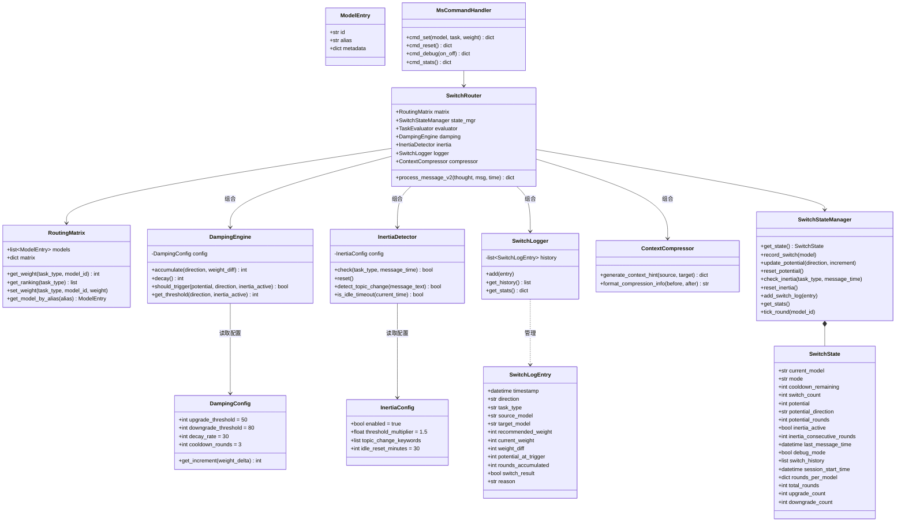

# Auto-Switch-Skill v0.2 技术设计文档

> **版本**：v0.2-beta  
> **日期**：2026-04-08  
> **对应需求**：`requirements_v0.2.md` v0.2-beta  
> **基线代码**：MVP v1.0 已实现代码  
> **用途**：供开发人员实现的详细技术设计，包含架构升级方案、新增模块设计、已有模块改造方案及接口定义  

---

## 文档目录

1. [升级概述](#1-升级概述)
   - 1.1 v0.2 核心变更总览
   - 1.2 设计原则
   - 1.3 技术约束与兼容性要求
2. [目录结构变更](#2-目录结构变更)
   - 2.1 v0.2 完整目录树
   - 2.2 新增文件清单
   - 2.3 修改文件清单
3. [类架构升级设计](#3-类架构升级设计)
   - 3.1 v0.2 类关系总览
   - 3.2 新增数据结构定义
   - 3.3 已有类的扩展字段
   - 3.4 常量与配置项变更
4. [新增模块详细设计](#4-新增模块详细设计)
   - 4.1 势能累积引擎 `damping.py`
   - 4.2 上下文惯性检测器 `inertia.py`
   - 4.3 切换日志管理 `logger.py`
   - 4.4 上下文压缩器 `context_compressor.py`
5. [已有模块改造设计](#5-已有模块改造设计)
   - 5.1 状态管理 `state.py` 扩展
   - 5.2 路由引擎 `router.py` 重构
   - 5.3 命令处理器 `ms_command.py` 扩展
   - 5.4 CLI 入口 `ms_cli.py` 改造
   - 5.5 格式化工具 `formatter.py` 扩展
   - 5.6 配置加载器 `loader.py` 扩展
   - 5.7 核心常量 `core/__init__.py` 扩展
6. [CLI 输出协议设计](#6-cli-输出协议设计)
   - 6.1 统一输出 Schema
   - 6.2 `output_json()` 统一输出函数
   - 6.3 各命令输出定义
   - 6.4 全局异常捕获
7. [SKILL.md 升级设计](#7-skillmd-升级设计)
   - 7.1 行为规则重写
   - 7.2 新增命令路由
   - 7.3 切换后上下文压缩指令
   - 7.4 调试脚注规则
8. [配置文件升级设计](#8-配置文件升级设计)
   - 8.1 `settings.yaml` 扩展
   - 8.2 `routing_matrix.yaml` 扩展
9. [测试策略](#9-测试策略)
   - 9.1 新增测试文件
   - 9.2 已有测试改造
   - 9.3 集成测试场景
10. [实施计划与开发顺序](#10-实施计划与开发顺序)
    - 10.1 分层实施策略
    - 10.2 开发顺序与依赖关系
    - 10.3 里程碑检查点

---

## 1. 升级概述

### 1.1 v0.2 核心变更总览

v0.2 在 MVP 的「评估 → 直接阈值判定 → 切换」闭环基础上，进行三大方向的架构升级：

```
MVP 流程:   评估 → 权重差 > 15？ → 立即切换
                        ↓
v0.2 流程:  评估 → 势能累积 → 惯性调整阈值 → 安全检查 → 切换 → 压缩上下文 → 写入日志
```

| 变更方向 | 涉及模块 | 核心改动 |
|:---------|:---------|:---------|
| **切换决策升级** | `damping.py`(新增)、`inertia.py`(新增)、`router.py`(重构) | 直接阈值 → 阻尼式势能累积 + 上下文惯性 |
| **输出协议统一** | `ms_cli.py`(改造)、`ms_command.py`(改造)、`SKILL.md`(重写) | 混合文本 → 统一单行 JSON `{action, status, data, message}` |
| **用户控制增强** | `ms_command.py`(扩展)、`formatter.py`(扩展) | 新增 `/ms set`、`/ms reset`、`/ms debug`、`/ms stats` 共 4 个命令 |
| **上下文压缩** | `context_compressor.py`(新增)、`SKILL.md`(指令新增) | 切换后通过指令引导模型清理冗余中间消息 |
| **安全检查** | `ms_command.py`(扩展)、`core/__init__.py`(常量新增) | 切换前校验目标模型上下文窗口 ≥ 150k |
| **日志记录** | `logger.py`(新增)、`state.py`(扩展) | 结构化切换日志（会话级内存） |

### 1.2 设计原则

#### 原则一：模型做执行者，脚本做决策者

> **模型只做一件事：调用一次工具脚本。所有逻辑判断封装在 Python 脚本中，模型只根据 `action` 字段执行对应行为。**

- 所有切换判定逻辑（别名解析、安全检查、势能累积、惯性判断等）封装在 Python 脚本中
- 模型不做 JSON 解析、不做条件分支判断
- 确保即使更换底层模型，切换行为也完全一致、可预测

#### 原则二：脚本输出规范化

> **脚本输出具有清晰的定义、数据格式和键名称，使模型的回复格式稳定、可靠。**

- 所有命令输出统一为 `{action, status, data, message}` 四字段 JSON
- 正常流程和异常流程共用同一输出 schema
- 全局 try-except 兜底，确保即使脚本崩溃也输出合法 JSON

#### 原则三：开闭原则（OCP）

> **对扩展开放，对修改关闭。新功能通过新增模块实现，已有模块仅做最小必要改动。**

- 势能累积、惯性检测、日志管理、上下文压缩 → 均为**新增独立模块**
- `router.py` 通过**组合**新模块实现功能升级，核心 `process_message()` 入口保持
- `ms_command.py` 通过**新增方法**扩展命令集，已有 `cmd_*()` 方法签名不变
- `state.py` 通过**新增字段**扩展状态，已有字段含义不变

### 1.3 技术约束与兼容性要求

| 约束 | 说明 |
|:-----|:-----|
| **向后兼容** | MVP 的 7 个 `/ms` 命令功能不回退 |
| **运行时零依赖** | 运行时仅依赖 Python 标准库（json、re、argparse、dataclasses、datetime）|
| **生成时依赖** | `generate_matrix.py` 和 YAML 配置加载需要 `pyyaml` |
| **配置向下兼容** | `settings.yaml` 缺少 v0.2 新增配置段时，代码使用默认值，不报错 |
| **状态不持久化** | 所有运行时状态（含势能、惯性、日志）仅会话内有效 |
| **单线程假设** | 每个会话一个实例，不使用锁 |
| **Python 版本** | Python 3.10+（需 `X | None` 类型语法支持） |

---

## 2. 目录结构变更

### 2.1 v0.2 完整目录树

以 🆕 标注 v0.2 新增文件，以 ✏️ 标注需要修改的已有文件：

```
auto-switch-skill/
├── SKILL.md                              ✏️ 命令路由 + 行为规则重写 + 压缩指令
├── README.md                             ✏️ 版本号更新
│
├── config/                               # 运行时配置目录
│   ├── model_profiles.yaml               # 内置画像库（不变）
│   ├── routing_matrix.json               # 预生成路由矩阵（不变）
│   ├── routing_matrix.yaml               ✏️ 新增 context_window 字段
│   └── settings.yaml                     ✏️ 新增 damping/inertia/debug/compression 配置段
│
├── scripts/
│   ├── generate_matrix.py                # 路由矩阵生成器（不变）
│   └── ms_cli.py                         ✏️ 统一 JSON 输出 + 全局异常捕获 + 4 个新子命令
│
├── src/
│   ├── __init__.py                       # 包入口（不变）
│   ├── config/
│   │   ├── __init__.py                   # （不变）
│   │   ├── schema.py                     # 数据模型定义（不变，已有 DampingConfig 等）
│   │   └── loader.py                     ✏️ 新增 load_settings_with_defaults() 方法
│   ├── core/
│   │   ├── __init__.py                   ✏️ 新增 MIN_SAFE_CONTEXT_WINDOW 等常量
│   │   ├── evaluator.py                  # 任务类型解析器（不变）
│   │   ├── state.py                      ✏️ SwitchState 新增 12 个字段 + SwitchStateManager 新增 8 个方法
│   │   ├── router.py                     ✏️ should_switch() 重构为势能判定 + 新增 process_message_v2()
│   │   ├── damping.py                    🆕 势能累积引擎
│   │   ├── inertia.py                    🆕 上下文惯性检测器
│   │   ├── logger.py                     🆕 切换日志管理（SwitchLogEntry + SwitchLogger）
│   │   └── context_compressor.py         🆕 上下文压缩器（context_hint 生成）
│   ├── skills/
│   │   ├── __init__.py                   # （不变）
│   │   └── ms_command.py                 ✏️ 新增 cmd_set/cmd_reset/cmd_debug/cmd_stats + 返回值改为 dict
│   └── utils/
│       ├── __init__.py                   # （不变）
│       └── formatter.py                  ✏️ 新增 format_debug_footnote/format_stats 等函数
│
├── tests/
│   ├── __init__.py
│   ├── conftest.py                       ✏️ 新增势能/惯性相关 fixture
│   ├── test_evaluator.py                 # （不变）
│   ├── test_state.py                     ✏️ 新增势能/惯性/日志状态测试
│   ├── test_router.py                    ✏️ 重构测试用例适配势能判定
│   ├── test_ms_command.py                ✏️ 返回值断言改为 dict + 新命令测试
│   ├── test_generate_matrix.py           # （不变）
│   ├── test_integration.py              ✏️ 新增势能累积集成场景
│   ├── test_damping.py                   🆕 势能引擎单元测试
│   ├── test_inertia.py                   🆕 惯性检测单元测试
│   ├── test_logger.py                    🆕 日志管理单元测试
│   ├── test_context_compressor.py        🆕 上下文压缩单元测试
│   └── test_cli_protocol.py             🆕 CLI 输出协议端到端测试
│
└── docs/
    ├── requirements.md                   # 完整需求文档（不变）
    ├── requirements_mvp.md               # MVP 需求文档（不变）
    ├── technical_design.md               # MVP 技术设计文档（不变）
    ├── context_switch_analysis.md        # 上下文切换分析（不变）
    └── v0.2/
        ├── requirements_v0.2.md          # v0.2 需求文档
        └── technical_design_v0.2.md      🆕 本文档
```

### 2.2 新增文件清单

| 文件 | 职责 | 关键依赖 | 预估行数 |
|:-----|:-----|:---------|:---------|
| `src/core/damping.py` | 势能累积与衰减逻辑，方向不对称阈值 | `schema.DampingConfig` | ~80 行 |
| `src/core/inertia.py` | 上下文惯性检测，话题转换信号识别 | `schema.InertiaConfig`、`datetime` | ~90 行 |
| `src/core/logger.py` | `SwitchLogEntry` 数据结构 + `SwitchLogger` 日志管理 | `dataclasses`、`datetime` | ~70 行 |
| `src/core/context_compressor.py` | 生成 `context_hint` 字段，度量压缩效果 | 无外部依赖 | ~50 行 |
| `tests/test_damping.py` | 势能累积/衰减/方向切换/归零 | `damping.py`、`pytest` | ~120 行 |
| `tests/test_inertia.py` | 惯性激活/重置/超时/关键词检测 | `inertia.py`、`pytest` | ~100 行 |
| `tests/test_logger.py` | 日志记录/查询/统计 | `logger.py`、`pytest` | ~80 行 |
| `tests/test_context_compressor.py` | context_hint 生成 | `context_compressor.py`、`pytest` | ~50 行 |
| `tests/test_cli_protocol.py` | 所有命令输出符合统一 JSON schema | `ms_cli.py`、`subprocess` | ~150 行 |

### 2.3 修改文件清单

| 文件 | 改动类型 | 改动摘要 |
|:-----|:---------|:---------|
| `src/core/__init__.py` | 常量新增 | 新增 `MIN_SAFE_CONTEXT_WINDOW`、`UPGRADE_*`、`DOWNGRADE_*` 等势能相关常量 |
| `src/core/state.py` | 字段+方法新增 | `SwitchState` 新增 12 个字段；`SwitchStateManager` 新增 8 个方法 |
| `src/core/router.py` | 方法重构+新增 | `should_switch()` 重构为势能判定；新增 `process_message_v2()` |
| `src/skills/ms_command.py` | 方法新增+签名变更 | 新增 4 个 `cmd_*()` 方法；所有 `cmd_*()` 返回值从 `str` 改为 `dict` |
| `src/utils/formatter.py` | 函数新增+更新 | 新增 `format_debug_footnote()`、`format_stats()`；更新 `format_help()`、`format_status()` |
| `src/config/loader.py` | 方法新增 | 新增 `load_settings_with_defaults()` 支持配置缺失时使用默认值 |
| `scripts/ms_cli.py` | 全面改造 | 所有输出改为 JSON；新增全局 try-except；新增 4 个子命令解析器 |
| `config/settings.yaml` | 配置段新增 | 新增 `damping`、`context_inertia`、`debug`、`context_compression` |
| `SKILL.md` | 指令重写 | 行为规则改为 action 驱动；新增命令路由；新增压缩指令 |

### 2.4 模块依赖关系（v0.2 升级后）

```
                    ┌──────────────────┐
                    │    SKILL.md      │  ← OpenClaw 加载入口
                    │  (统一 action    │
                    │   行为规则)      │
                    └────────┬─────────┘
                             │ 指令调用
                             ▼
                    ┌──────────────────┐
                    │   ms_cli.py      │  ← CLI 入口（统一 JSON 输出）
                    └────────┬─────────┘
                             │
                             ▼
                    ┌──────────────────┐
                    │  ms_command.py   │  ← 命令解析 & 分发（11 个命令）
                    │  (用户接口层)    │     所有 cmd_*() 返回 dict
                    └───┬──┬──┬──┬────┘
                        │  │  │  │
          ┌─────────────┘  │  │  └─────────────────┐
          ▼                │  │                     ▼
  ┌──────────────┐         │  │            ┌──────────────┐
  │  router.py   │         │  │            │ formatter.py │
  │  (路由引擎)  │         │  │            │  (格式化)    │
  │  v0.2:势能判定│         │  │            └──────────────┘
  └──┬──┬──┬──┬──┘         │  │
     │  │  │  │            │  │
     │  │  │  └──────┐     │  │
     │  │  │         ▼     ▼  │
     │  │  │  ┌──────────────┐│
     │  │  │  │  state.py    ││
     │  │  │  │  (状态管理)  ││
     │  │  │  │  v0.2:+12字段││
     │  │  │  └──────────────┘│
     │  │  │                  │
     │  │  └─────────┐       │
     ▼  ▼            ▼       ▼
  ┌────────┐  ┌──────────┐ ┌──────────────────────┐
  │damping │  │ inertia  │ │   evaluator.py       │
  │  .py   │  │   .py    │ │   (任务解析，不变)    │
  │  🆕    │  │   🆕     │ └──────────────────────┘
  └────────┘  └──────────┘

  ┌──────────────┐  ┌───────────────────────┐
  │  logger.py   │  │ context_compressor.py │
  │  🆕 切换日志 │  │ 🆕 上下文压缩         │
  └──────────────┘  └───────────────────────┘

  ┌──────────────────────────────────────────────┐
  │  config 层（schema.py + loader.py）           │
  │  被所有上层模块引用                            │
  └──────────────────────────────────────────────┘
```

---

## 3. 类架构升级设计

### 3.1 v0.2 类关系总览



### 3.2 新增数据结构定义

#### `SwitchLogEntry`（定义在 `logger.py`）

```python
from dataclasses import dataclass
from datetime import datetime


@dataclass
class SwitchLogEntry:
    """切换日志条目

    记录每次模型切换的完整上下文信息，用于 /ms stats 统计和 /ms debug 展示。
    """
    timestamp: datetime          # 切换时间戳
    direction: str               # "upgrade" | "downgrade"
    task_type: str               # 触发切换的任务类型
    source_model: str            # 来源模型 ID
    target_model: str            # 目标模型 ID
    recommended_weight: int      # 推荐模型权重
    current_weight: int          # 当前模型权重
    weight_diff: int             # 权重差值
    potential_at_trigger: int    # 触发时的势能值
    rounds_accumulated: int      # 势能累积经过的轮数
    switch_result: bool          # 切换是否成功
    reason: str                  # 切换原因文本描述
```

#### CLI 输出协议类型（定义在 `ms_command.py` 或 `core/__init__.py` 中作为 TypedDict）

```python
from typing import TypedDict, Any


class CliOutput(TypedDict):
    """统一 CLI 输出格式"""
    action: str       # "switch" | "display" | "error"
    status: str       # "ok" | "error"
    data: dict[str, Any]
    message: str      # 面向用户的展示文本
```

### 3.3 已有类的扩展字段

#### `SwitchState` 新增字段

| 新增字段 | 类型 | 默认值 | 说明 | 被谁读写 |
|:---------|:-----|:------|:-----|:---------|
| `potential` | `int` | 0 | 当前切换势能值 | `DampingEngine` 读写 |
| `potential_direction` | `str` | `""` | 势能方向 `"upgrade"` / `"downgrade"` / `""` | `DampingEngine` 读写 |
| `potential_rounds` | `int` | 0 | 势能连续累积的轮数 | `DampingEngine` 读写 |
| `inertia_active` | `bool` | `False` | 上下文惯性是否活跃 | `InertiaDetector` 读写 |
| `inertia_consecutive_rounds` | `int` | 0 | 连续同主题轮数 | `InertiaDetector` 读写 |
| `last_message_time` | `datetime \| None` | `None` | 上次消息时间 | `InertiaDetector` 读写 |
| `debug_mode` | `bool` | `False` | 调试模式开关 | `cmd_debug()` 写，`formatter` 读 |
| `switch_history` | `list[SwitchLogEntry]` | `[]` | 切换历史日志 | `SwitchLogger` 写，`cmd_stats()` 读 |
| `session_start_time` | `datetime` | `datetime.now()` | 会话开始时间 | `cmd_stats()` 读 |
| `rounds_per_model` | `dict[str, int]` | `{}` | 各模型使用轮数 | `tick_round()` 写，`cmd_stats()` 读 |
| `total_rounds` | `int` | 0 | 总对话轮数 | `tick_round()` 写 |
| `upgrade_count` | `int` | 0 | 升级切换次数 | `record_switch()` 写 |
| `downgrade_count` | `int` | 0 | 降级切换次数 | `record_switch()` 写 |

### 3.4 常量与配置项变更

#### `src/core/__init__.py` 新增常量

```python
# ─── v0.2 新增常量 ───

# 上下文窗口安全检查
MIN_SAFE_CONTEXT_WINDOW = 150000     # 最小安全上下文窗口（150k tokens）

# 势能相关默认值（可通过 settings.yaml 覆盖）
DEFAULT_UPGRADE_INCREMENT = 40       # 升级方向每轮势能增量
DEFAULT_DOWNGRADE_INCREMENT = 20     # 降级方向每轮势能增量
DEFAULT_UPGRADE_THRESHOLD = 50       # 升级触发阈值
DEFAULT_DOWNGRADE_THRESHOLD = 80     # 降级触发阈值
DEFAULT_DECAY_RATE = 30              # 势能衰减值

# 惯性相关默认值
DEFAULT_INERTIA_MULTIPLIER = 1.5     # 惯性活跃时阈值放大倍数
DEFAULT_IDLE_RESET_MINUTES = 30      # 超时重置惯性的分钟数

# 错误码
ERROR_MODEL_NOT_FOUND = "MODEL_NOT_FOUND"
ERROR_CONTEXT_WINDOW_UNSAFE = "CONTEXT_WINDOW_UNSAFE"
ERROR_SWITCH_LIMIT_REACHED = "SWITCH_LIMIT_REACHED"
ERROR_INTERNAL = "INTERNAL_ERROR"
ERROR_INVALID_PARAMS = "INVALID_PARAMS"
ERROR_UNKNOWN_TASK_ABBREV = "UNKNOWN_TASK_ABBREV"
ERROR_WEIGHT_OUT_OF_RANGE = "WEIGHT_OUT_OF_RANGE"
```

#### `schema.py` 中已有但 MVP 未使用的类

以下类在 `schema.py` 中**已经存在**，v0.2 将开始使用它们：

| 类名 | MVP 状态 | v0.2 状态 | 说明 |
|:-----|:---------|:---------|:-----|
| `DampingConfig` | ❌ 未使用 | ✅ 使用 | 势能阻尼参数，被 `DampingEngine` 读取 |
| `InertiaConfig` | ❌ 未使用 | ✅ 使用 | 惯性参数，被 `InertiaDetector` 读取 |
| `SwitcherConfig` | ⚠️ 部分使用 | ✅ 完整使用 | 包含 `damping` 和 `inertia` 子配置 |

> **注意**：`schema.py` 中的 `DampingConfig` 使用了 `weight_delta_tiers` 分级配置，而 v0.2 需求文档使用了简单的固定增量（升级 +40/降级 +20）。v0.2 实现时使用 `DampingConfig` 中已有的 `get_increment()` 方法即可——当权重差大于 15 时，根据 tiers 配置返回对应增量。如果需要简化为固定增量，可在 `settings.yaml` 中配置单层 tier。

---

## 4. 新增模块详细设计

### 4.1 势能累积引擎 `src/core/damping.py`

#### 4.1.1 模块概述

| 项目 | 说明 |
|:-----|:-----|
| 文件位置 | `src/core/damping.py` |
| 核心职责 | 封装势能累积/衰减/触发判定逻辑 |
| 上游 | `router.py` 的 `process_message_v2()` 调用 |
| 下游 | 读取 `DampingConfig` 配置；读写 `SwitchState` 中的势能字段 |
| 设计原则 | 纯计算逻辑，不持有状态，通过 `SwitchStateManager` 操作状态 |

#### 4.1.2 核心算法

```
每轮评估后:
    if 推荐模型 ≠ 当前模型 且 |权重差| > weight_diff_threshold (15):
        判断方向（升级/降级）
        if 方向与上一轮一致:
            势能 += 方向增量
            势能轮数 += 1
        else:
            势能 = 方向增量（方向切换，重新计数）
            势能轮数 = 1
    else:
        势能 = max(势能 - 衰减值, 0)
        if 势能 == 0: 势能轮数 = 0

    最终阈值 = 基础阈值 × (惯性倍数 if 惯性活跃 else 1.0)

    if 势能 >= 最终阈值:
        → 触发切换，势能归零，势能轮数归零
```

#### 4.1.3 方向不对称参数

| 参数 | 升级方向 | 降级方向 | 说明 |
|:-----|:---------|:---------|:-----|
| 基础阈值 | 50 | 80 | 升级更敏感 |
| 每轮增量 | +40 | +20 | 升级累积更快 |
| 衰减值 | 30 | 30 | 衰减速度一致 |
| 约需连续轮数 | ~2 轮 | ~4-5 轮 | 升级响应更快 |

> 以上参数通过 `DampingConfig` 配置，`settings.yaml` 可覆盖。

#### 4.1.4 完整接口定义

```python
"""势能累积引擎

实现阻尼式势能累积机制，替代 MVP 的直接阈值判定。
纯计算逻辑，不持有状态。
"""

from __future__ import annotations

from src.config.schema import DampingConfig
from src.core.state import SwitchStateManager


class DampingEngine:
    """势能累积引擎

    使用方式：
        engine = DampingEngine(config=DampingConfig())
        triggered = engine.process(state_mgr, weight_diff, direction, inertia_active)
    """

    def __init__(self, config: DampingConfig | None = None):
        """
        Args:
            config: 阻尼配置，默认使用 DampingConfig 默认值
        """
        self.config = config or DampingConfig()

    def process(
        self,
        state_mgr: SwitchStateManager,
        weight_diff: int,
        direction: str,
        inertia_active: bool = False,
    ) -> bool:
        """处理一轮势能更新，返回是否触发切换

        这是 DampingEngine 的唯一入口方法。

        Args:
            state_mgr: 状态管理器
            weight_diff: 权重差绝对值（已确认 > weight_diff_threshold）
            direction: 切换方向 "upgrade" | "downgrade"
            inertia_active: 惯性是否活跃

        Returns:
            True 如果势能越过阈值，应触发切换
        """
        state = state_mgr.get_state()

        # 方向一致 → 累积；方向切换 → 重置后累积
        increment = self._get_increment(direction, weight_diff)
        if state.potential_direction == direction:
            state_mgr.update_potential(direction, increment)
        else:
            state_mgr.reset_potential()
            state_mgr.update_potential(direction, increment)

        # 判断是否触发
        threshold = self.get_threshold(direction, inertia_active)
        if state.potential >= threshold:
            state_mgr.reset_potential()
            return True

        return False

    def decay(self, state_mgr: SwitchStateManager) -> None:
        """势能衰减（当权重差不足或推荐模型不变时调用）

        Args:
            state_mgr: 状态管理器
        """
        state = state_mgr.get_state()
        new_potential = max(state.potential - self.config.decay_rate, 0)
        if new_potential == 0:
            state_mgr.reset_potential()
        else:
            state.potential = new_potential

    def get_threshold(self, direction: str, inertia_active: bool = False) -> int:
        """获取当前方向的触发阈值（考虑惯性）

        Args:
            direction: "upgrade" | "downgrade"
            inertia_active: 惯性是否活跃

        Returns:
            最终触发阈值
        """
        if direction == "upgrade":
            base = self.config.upgrade_threshold
        else:
            base = self.config.downgrade_threshold

        if inertia_active:
            return int(base * 1.5)  # 惯性倍数硬编码为 1.5，也可从 InertiaConfig 读取
        return base

    def _get_increment(self, direction: str, weight_diff: int) -> int:
        """获取势能增量

        优先使用 DampingConfig.get_increment()（基于 weight_delta_tiers），
        回退到固定增量。

        Args:
            direction: 切换方向
            weight_diff: 权重差绝对值

        Returns:
            势能增量
        """
        # DampingConfig 已有 get_increment() 方法支持分级增量
        return self.config.get_increment(weight_diff)
```

#### 4.1.5 与 `SwitchStateManager` 的交互

`DampingEngine` 不直接修改 `SwitchState`，而是通过 `SwitchStateManager` 的以下新增方法：

| 方法 | 操作 |
|:-----|:-----|
| `update_potential(direction, increment)` | `potential += increment`; `potential_direction = direction`; `potential_rounds += 1` |
| `reset_potential()` | `potential = 0`; `potential_direction = ""`; `potential_rounds = 0` |

#### 4.1.6 边界情况

| 场景 | 处理方式 |
|:-----|:---------|
| 首轮评估，势能为 0 | 正常累积，方向设为当前方向 |
| 方向切换（上一轮升级，本轮降级） | 势能归零后重新从新方向累积 |
| 势能衰减到 0 | 势能方向和轮数同时归零 |
| 惯性倍数使阈值提高后，惯性突然失效 | 已累积势能不变，下一轮用原始阈值判断，可能立即触发 |

#### 4.1.7 测试用例要求

```python
def test_basic_upgrade_trigger():
    """升级方向：2 轮连续累积触发切换"""

def test_basic_downgrade_trigger():
    """降级方向：~4-5 轮连续累积触发切换"""

def test_decay_when_no_signal():
    """无切换信号时势能衰减"""

def test_direction_switch_resets():
    """方向切换时势能归零重新累积"""

def test_inertia_raises_threshold():
    """惯性活跃时阈值 ×1.5"""

def test_potential_zero_after_trigger():
    """触发切换后势能归零"""
```

### 4.2 上下文惯性检测器 `src/core/inertia.py`

#### 4.2.1 模块概述

| 项目 | 说明 |
|:-----|:-----|
| 文件位置 | `src/core/inertia.py` |
| 核心职责 | 检测当前是否处于连贯的多轮任务对话中，动态调整惯性状态 |
| 上游 | `router.py` 的 `process_message_v2()` 在势能判定前调用 |
| 下游 | 读取 `InertiaConfig` 配置；读写 `SwitchState` 中的惯性字段 |
| 设计原则 | 纯检测逻辑，不影响势能累积速度，只影响触发阈值 |

#### 4.2.2 惯性判定流程

```
check(task_type, message_text, message_time) 入口
    │
    ▼
[超时检查] 距离 last_message_time > 30 分钟？
    │
    ├── 是 → 惯性重置，返回 False
    │
    └── 否
         │
         ▼
    [话题转换检测] message_text 包含转换关键词？
         │
         ├── 是 → 惯性重置，返回 False
         │
         └── 否
              │
              ▼
         [连续性计数] 同主题轮数 += 1
              │
              ▼
         同主题轮数 >= 3 (默认) ？
              │
              ├── 是 → inertia_active = True，返回 True
              └── 否 → inertia_active = False，返回 False
    │
    ▼
[更新时间戳] last_message_time = message_time
```

#### 4.2.3 话题转换信号词

```python
DEFAULT_TOPIC_CHANGE_KEYWORDS = [
    "新的需求", "另一个问题", "换个话题", "接下来",
    "新任务", "下一个", "别的事情",
]
```

> 检测方式：对用户消息文本执行子串匹配（`any(kw in message_text for kw in keywords)`）。

#### 4.2.4 完整接口定义

```python
"""上下文惯性检测器

检测当前对话是否处于连贯的多轮任务中。
惯性活跃时，切换阈值提高 ×1.5，使切换更难触发。
"""

from __future__ import annotations

from datetime import datetime, timedelta

from src.config.schema import InertiaConfig
from src.core.state import SwitchStateManager


class InertiaDetector:
    """上下文惯性检测器

    使用方式：
        detector = InertiaDetector(config=InertiaConfig())
        is_active = detector.check(state_mgr, task_type, message_text, now)
    """

    # 默认连续同主题轮数阈值
    MIN_CONSECUTIVE_ROUNDS = 3

    def __init__(self, config: InertiaConfig | None = None):
        self.config = config or InertiaConfig()

    def check(
        self,
        state_mgr: SwitchStateManager,
        task_type: str,
        message_text: str,
        current_time: datetime,
    ) -> bool:
        """检查并更新惯性状态

        Args:
            state_mgr: 状态管理器
            task_type: 本轮评估的任务类型
            message_text: 用户消息文本（用于话题转换检测）
            current_time: 当前消息时间

        Returns:
            True 如果惯性活跃（应提高切换阈值）
        """
        if not self.config.enabled:
            return False

        state = state_mgr.get_state()

        # 超时检查
        if self._is_idle_timeout(state.last_message_time, current_time):
            state_mgr.reset_inertia()
            state.last_message_time = current_time
            return False

        # 话题转换检测
        if self._detect_topic_change(message_text):
            state_mgr.reset_inertia()
            state.last_message_time = current_time
            return False

        # 更新连续轮数
        state.inertia_consecutive_rounds += 1
        state.last_message_time = current_time

        # 判定惯性是否活跃
        is_active = state.inertia_consecutive_rounds >= self.MIN_CONSECUTIVE_ROUNDS
        state.inertia_active = is_active
        return is_active

    def _detect_topic_change(self, message_text: str) -> bool:
        """检测消息中是否包含话题转换信号词"""
        if not message_text:
            return False
        return any(kw in message_text for kw in self.config.topic_change_keywords)

    def _is_idle_timeout(
        self, last_time: datetime | None, current_time: datetime
    ) -> bool:
        """检测是否超过空闲超时时间"""
        if last_time is None:
            return False
        delta = current_time - last_time
        return delta > timedelta(minutes=self.config.idle_reset_minutes)
```

#### 4.2.5 与势能机制的交互

- 惯性**不改变**势能累积速度（增量和衰减速度不变）
- 惯性**只改变**触发阈值（×1.5 倍放大）
- 惯性因话题转换重置后，已累积势能保留，可能在下一轮立即越过降低后的阈值

#### 4.2.6 测试用例要求

```python
def test_inertia_activates_after_3_rounds():
    """连续 3 轮同主题后惯性激活"""

def test_topic_change_resets_inertia():
    """话题转换关键词重置惯性"""

def test_idle_timeout_resets_inertia():
    """超过 30 分钟间隔重置惯性"""

def test_disabled_config():
    """config.enabled=False 时始终返回 False"""

def test_first_message_no_timeout():
    """首条消息（last_message_time=None）不触发超时"""
```

### 4.3 切换日志管理 `src/core/logger.py`

#### 4.3.1 模块概述

| 项目 | 说明 |
|:-----|:-----|
| 文件位置 | `src/core/logger.py` |
| 核心职责 | 记录每次切换的结构化日志，支持统计查询 |
| 上游 | `router.py` 在切换执行后调用 `add()` |
| 下游 | `cmd_stats()` 读取统计；`cmd_debug()` 读取最近记录 |
| 持久化 | v0.2 **不持久化**，仅会话内有效（`list` 存储） |

#### 4.3.2 完整接口定义

```python
"""切换日志管理

记录每次模型切换的结构化日志，为 /ms stats 和 /ms debug 提供数据源。
v0.2 仅做会话级内存存储，v0.3 将实现持久化。
"""

from __future__ import annotations

from dataclasses import dataclass, field
from datetime import datetime


@dataclass
class SwitchLogEntry:
    """切换日志条目（数据结构定义见 §3.2）"""
    timestamp: datetime
    direction: str
    task_type: str
    source_model: str
    target_model: str
    recommended_weight: int
    current_weight: int
    weight_diff: int
    potential_at_trigger: int
    rounds_accumulated: int
    switch_result: bool
    reason: str


class SwitchLogger:
    """切换日志管理器

    使用方式：
        logger = SwitchLogger()
        logger.add(SwitchLogEntry(...))
        stats = logger.get_stats()
    """

    def __init__(self):
        self._history: list[SwitchLogEntry] = []

    def add(self, entry: SwitchLogEntry) -> None:
        """添加一条切换日志"""
        self._history.append(entry)

    def get_history(self) -> list[SwitchLogEntry]:
        """获取完整切换历史"""
        return list(self._history)

    def get_latest(self) -> SwitchLogEntry | None:
        """获取最近一条切换记录"""
        return self._history[-1] if self._history else None

    def get_stats(self) -> dict:
        """聚合统计数据

        Returns:
            {
                "total_switches": int,
                "upgrade_count": int,
                "downgrade_count": int,
                "success_count": int,
                "fail_count": int,
            }
        """
        total = len(self._history)
        upgrades = sum(1 for e in self._history if e.direction == "upgrade")
        downgrades = sum(1 for e in self._history if e.direction == "downgrade")
        successes = sum(1 for e in self._history if e.switch_result)
        return {
            "total_switches": total,
            "upgrade_count": upgrades,
            "downgrade_count": downgrades,
            "success_count": successes,
            "fail_count": total - successes,
        }
```

#### 4.3.3 测试用例要求

```python
def test_add_and_get_history():
    """添加日志后可查询"""

def test_get_stats_aggregation():
    """统计数据正确聚合"""

def test_get_latest_empty():
    """空日志返回 None"""

def test_get_latest_returns_last():
    """多条记录返回最后一条"""
```

### 4.4 上下文压缩器 `src/core/context_compressor.py`

#### 4.4.1 模块概述

| 项目 | 说明 |
|:-----|:-----|
| 文件位置 | `src/core/context_compressor.py` |
| 核心职责 | 生成切换后的上下文压缩提示，引导模型清理冗余信息 |
| 上游 | `router.py` 在切换执行后调用 |
| 下游 | 输出嵌入到 CLI JSON 的 `data.context_hint` 字段 |
| 设计定位 | v0.2 轻量级方案（指令引导），为 v0.3 三层记忆栈铺垫 |

#### 4.4.2 压缩策略

v0.2 提供两种互补的压缩策略，通过 `settings.yaml` 配置选择：

| 策略 | 实现方式 | 适用场景 |
|:-----|:---------|:---------|
| `skill_instruction` | 在 SKILL.md 中静态写入压缩规则 | 所有切换场景 |
| `context_hint` | 在 CLI 输出的 `data` 中动态注入压缩提示 | 需要模型感知压缩 |

两种策略**可同时生效**：SKILL.md 提供通用规则，`context_hint` 提供本次切换的具体信息。

#### 4.4.3 完整接口定义

```python
"""上下文压缩器

生成切换后的上下文压缩提示，减少切换过程中产生的 token 膨胀。
v0.2 为轻量级指令引导方案。
"""

from __future__ import annotations


class ContextCompressor:
    """上下文压缩器

    使用方式：
        compressor = ContextCompressor(strategy="context_hint")
        hint = compressor.generate_context_hint(
            source_model="sjtu/minimax-m2.5",
            target_model="sjtu/deepseek-v3.2",
            source_alias="mm",
            target_alias="ds-v3",
        )
    """

    def __init__(self, strategy: str = "context_hint", enabled: bool = True):
        """
        Args:
            strategy: 压缩策略 "skill_instruction" | "context_hint"
            enabled: 是否启用压缩
        """
        self.strategy = strategy
        self.enabled = enabled

    def generate_context_hint(
        self,
        source_model: str,
        target_model: str,
        source_alias: str = "",
        target_alias: str = "",
    ) -> str:
        """生成上下文压缩提示文本

        该文本会被嵌入到切换结果的 data.context_hint 字段中，
        引导模型忽略切换过程的中间消息。

        Args:
            source_model: 来源模型 ID
            target_model: 目标模型 ID
            source_alias: 来源模型别名
            target_alias: 目标模型别名

        Returns:
            压缩提示文本
        """
        if not self.enabled:
            return ""

        src = source_alias or source_model.split("/")[-1]
        tgt = target_alias or target_model.split("/")[-1]

        return (
            f"切换完成（{src} → {tgt}）。"
            f"忽略本次切换过程中的中间输出，仅保留此摘要。"
        )

    def format_compression_info(self, token_estimate: int = 0) -> str:
        """格式化压缩效果信息（用于 debug 脚注）

        Args:
            token_estimate: 预估减少的 token 数（0 表示未知）

        Returns:
            格式化的压缩信息文本
        """
        if token_estimate > 0:
            return f"压缩后(上次切换减少~{token_estimate // 1000}k tokens)"
        return "压缩后(效果待量化)"
```

#### 4.4.4 与 CLI 输出的集成

当 `action="switch"` 且压缩启用时，`data` 中包含 `context_hint` 字段：

```json
{
  "action": "switch",
  "status": "ok",
  "data": {
    "target_model": "sjtu/deepseek-v3.2",
    "previous_model": "sjtu/minimax-m2.5",
    "context_hint": "切换完成（mm → ds-v3）。忽略本次切换过程中的中间输出，仅保留此摘要。"
  },
  "message": "✅ 模型已切换: mm → ds-v3"
}
```

#### 4.4.5 测试用例要求

```python
def test_generate_hint_enabled():
    """启用时生成非空提示"""

def test_generate_hint_disabled():
    """禁用时返回空字符串"""

def test_hint_contains_model_names():
    """提示文本包含来源和目标模型名"""

def test_compression_info_with_estimate():
    """有 token 估算时格式化正确"""
```

---

## 5. 已有模块改造设计

### 5.1 状态管理 `state.py` 扩展

#### 5.1.1 改动摘要

| 改动项 | 说明 |
|:-------|:-----|
| `SwitchState` | 新增 12 个字段（详见 §3.3） |
| `SwitchStateManager` | 新增 8 个方法 |
| 已有方法 | `record_switch()` 增加 `direction` 参数 |
| 兼容性 | 已有字段和方法签名不变（`record_switch` 除外） |

#### 5.1.2 `SwitchState` 扩展后完整定义

```python
@dataclass
class SwitchState:
    """运行时切换状态（会话级，不持久化）"""
    # ─── MVP 已有字段（不变） ───
    current_model: str = ""
    mode: str = "auto"
    cooldown_remaining: int = 0
    switch_count: int = 0
    last_task_type: str = ""
    last_recommended_model: str = ""
    last_recommended_weight: int = 0

    # ─── v0.2 新增：势能相关 ───
    potential: int = 0
    potential_direction: str = ""       # "upgrade" | "downgrade" | ""
    potential_rounds: int = 0

    # ─── v0.2 新增：惯性相关 ───
    inertia_active: bool = False
    inertia_consecutive_rounds: int = 0
    last_message_time: datetime | None = None

    # ─── v0.2 新增：调试与统计 ───
    debug_mode: bool = False
    switch_history: list = field(default_factory=list)
    session_start_time: datetime = field(default_factory=datetime.now)
    rounds_per_model: dict = field(default_factory=dict)
    total_rounds: int = 0
    upgrade_count: int = 0
    downgrade_count: int = 0
```

#### 5.1.3 `SwitchStateManager` 新增方法

```python
def update_potential(self, direction: str, increment: int) -> None:
    """累积势能

    Args:
        direction: "upgrade" | "downgrade"
        increment: 势能增量
    """
    self._state.potential += increment
    self._state.potential_direction = direction
    self._state.potential_rounds += 1

def reset_potential(self) -> None:
    """势能归零"""
    self._state.potential = 0
    self._state.potential_direction = ""
    self._state.potential_rounds = 0

def reset_inertia(self) -> None:
    """重置惯性状态"""
    self._state.inertia_active = False
    self._state.inertia_consecutive_rounds = 0

def add_switch_log(self, entry) -> None:
    """添加切换日志条目"""
    self._state.switch_history.append(entry)

def get_stats(self) -> dict:
    """获取统计数据

    Returns:
        包含切换次数、模型占比等统计信息的字典
    """
    state = self._state
    elapsed = datetime.now() - state.session_start_time
    return {
        "elapsed": elapsed,
        "total_rounds": state.total_rounds,
        "switch_count": state.switch_count,
        "upgrade_count": state.upgrade_count,
        "downgrade_count": state.downgrade_count,
        "rounds_per_model": dict(state.rounds_per_model),
    }

def tick_round(self, model_id: str) -> None:
    """计数一轮对话，更新模型使用统计

    Args:
        model_id: 本轮使用的模型 ID
    """
    self._state.total_rounds += 1
    if model_id not in self._state.rounds_per_model:
        self._state.rounds_per_model[model_id] = 0
    self._state.rounds_per_model[model_id] += 1
```

#### 5.1.4 `record_switch()` 签名变更

```python
# MVP 版本
def record_switch(self, new_model: str) -> None:

# v0.2 版本（增加 direction 参数）
def record_switch(self, new_model: str, direction: str = "") -> None:
    """记录一次模型切换

    Args:
        new_model: 新的模型 ID
        direction: 切换方向 "upgrade" | "downgrade"（v0.2 新增）
    """
    self._state.current_model = new_model
    self._state.switch_count += 1
    self._state.cooldown_remaining = COOLDOWN_ROUNDS
    # v0.2 新增：记录方向统计
    if direction == "upgrade":
        self._state.upgrade_count += 1
    elif direction == "downgrade":
        self._state.downgrade_count += 1
```

> **向后兼容**：`direction` 参数有默认值 `""`，MVP 代码中不传此参数也不会报错。

### 5.2 路由引擎 `router.py` 重构

#### 5.2.1 改动摘要

| 改动项 | 说明 |
|:-------|:-----|
| `__init__()` | 新增 `damping`、`inertia`、`logger`、`compressor` 四个组合依赖 |
| `should_switch()` | 从直接阈值判定重构为势能累积判定 |
| `process_message()` | 保留但标记为 deprecated，内部转发到 `process_message_v2()` |
| `process_message_v2()` | 🆕 v0.2 完整决策流程入口 |
| `execute_switch()` | 增加日志记录和上下文压缩 |

#### 5.2.2 构造函数变更

```python
class SwitchRouter:
    def __init__(
        self,
        matrix: RoutingMatrix,
        state_mgr: SwitchStateManager,
        evaluator: TaskEvaluator | None = None,
        # ─── v0.2 新增依赖 ───
        damping: DampingEngine | None = None,
        inertia: InertiaDetector | None = None,
        logger: SwitchLogger | None = None,
        compressor: ContextCompressor | None = None,
    ):
        self.matrix = matrix
        self.state_mgr = state_mgr
        self.evaluator = evaluator or TaskEvaluator()
        # v0.2：如果未传入则创建默认实例
        self.damping = damping or DampingEngine()
        self.inertia = inertia or InertiaDetector()
        self.logger = logger or SwitchLogger()
        self.compressor = compressor or ContextCompressor()
```

> **向后兼容**：所有新增依赖均有默认值，MVP 代码中 `SwitchRouter(matrix, state_mgr)` 仍可正常工作。

#### 5.2.3 `process_message_v2()` 完整决策流程

```python
def process_message_v2(
    self,
    thought_text: str,
    message_text: str = "",
    message_time: datetime | None = None,
) -> dict:
    """v0.2 完整消息处理（含势能累积 + 惯性检查）

    Args:
        thought_text: 模型 thought/thinking 字段文本
        message_text: 用户消息文本（用于惯性检测）
        message_time: 消息时间（默认 now()）

    Returns:
        符合 CLI 输出协议的 dict {action, status, data, message}
    """
    now = message_time or datetime.now()

    # Step 0: 计数轮次
    state = self.state_mgr.get_state()
    self.state_mgr.tick_round(state.current_model)

    # Step 1: 递减冷却
    self.state_mgr.tick_cooldown()

    # Step 2: 前置检查
    if state.mode != "auto":
        return {"action": "display", "status": "ok",
                "data": {"decision": "no_switch"}, "message": ""}
    if self.state_mgr.is_in_cooldown():
        return {"action": "display", "status": "ok",
                "data": {"decision": "no_switch"}, "message": ""}
    if self.state_mgr.is_at_limit():
        return {"action": "display", "status": "ok",
                "data": {"decision": "no_switch"}, "message": ""}

    # Step 3: 评估任务类型
    evaluation = self.evaluator.evaluate(
        thought_text, state.current_model, self.matrix
    )
    if evaluation is None:
        self.damping.decay(self.state_mgr)
        return {"action": "display", "status": "ok",
                "data": {"decision": "no_switch"}, "message": ""}

    # Step 4: 记录评估结果
    self.state_mgr.update_last_evaluation(
        evaluation.task_type,
        evaluation.recommended_model,
        evaluation.recommended_weight,
    )

    # Step 5: 惯性检测
    inertia_active = self.inertia.check(
        self.state_mgr, evaluation.task_type, message_text, now
    )

    # Step 6: 势能累积判定
    if (evaluation.recommended_model == state.current_model
            or abs(evaluation.weight_diff) <= WEIGHT_DIFF_THRESHOLD):
        self.damping.decay(self.state_mgr)
        return {"action": "display", "status": "ok",
                "data": {"decision": "no_switch"}, "message": ""}

    direction = "upgrade" if evaluation.weight_diff > 0 else "downgrade"
    triggered = self.damping.process(
        self.state_mgr, abs(evaluation.weight_diff), direction, inertia_active
    )

    if not triggered:
        return {"action": "display", "status": "ok",
                "data": {"decision": "no_switch"}, "message": ""}

    # Step 7: 安全检查
    target_model_entry = self.matrix.get_model_by_id(
        evaluation.recommended_model
    )
    if target_model_entry:
        ctx_window = target_model_entry.metadata.get("contextWindow", 0)
        if ctx_window and ctx_window < MIN_SAFE_CONTEXT_WINDOW:
            return {
                "action": "error", "status": "error",
                "data": {
                    "error_code": "CONTEXT_WINDOW_UNSAFE",
                    "target_model": evaluation.recommended_model,
                    "context_window": ctx_window,
                },
                "message": f"⚠️ 拒绝切换: 上下文窗口 {ctx_window//1024}k < 安全阈值 150k",
            }

    # Step 8: 执行切换
    result = self.execute_switch(
        evaluation.recommended_model, direction, evaluation
    )
    return result
```

#### 5.2.4 `should_switch()` 重构

MVP 版本的 `should_switch()` 保留但重构为势能判定的简单包装：

```python
def should_switch(self, evaluation: TaskEvaluation) -> bool:
    """判断是否应该切换（v0.2：势能判定）

    注意：此方法现在仅做势能触发判断，不再是简单的阈值比较。
    推荐使用 process_message_v2() 作为完整入口。
    """
    state = self.state_mgr.get_state()
    if (evaluation.recommended_model == state.current_model
            or abs(evaluation.weight_diff) <= WEIGHT_DIFF_THRESHOLD):
        self.damping.decay(self.state_mgr)
        return False

    direction = "upgrade" if evaluation.weight_diff > 0 else "downgrade"
    return self.damping.process(
        self.state_mgr, abs(evaluation.weight_diff),
        direction, state.inertia_active,
    )
```

#### 5.2.5 `execute_switch()` 增强

```python
def execute_switch(
    self,
    target_model: str,
    direction: str = "",
    evaluation: TaskEvaluation | None = None,
) -> dict:
    """执行模型切换（v0.2：增加日志和压缩）

    Returns:
        符合 CLI 输出协议的 dict
    """
    state = self.state_mgr.get_state()
    previous = state.current_model
    potential_at_trigger = state.potential
    rounds_accumulated = state.potential_rounds

    try:
        self.state_mgr.record_switch(target_model, direction)

        # v0.2：记录切换日志
        if evaluation:
            from src.core.logger import SwitchLogEntry
            entry = SwitchLogEntry(
                timestamp=datetime.now(),
                direction=direction,
                task_type=evaluation.task_type,
                source_model=previous,
                target_model=target_model,
                recommended_weight=evaluation.recommended_weight,
                current_weight=evaluation.current_weight,
                weight_diff=evaluation.weight_diff,
                potential_at_trigger=potential_at_trigger,
                rounds_accumulated=rounds_accumulated,
                switch_result=True,
                reason=f"任务类型切换: {evaluation.task_type}, "
                       f"{rounds_accumulated}轮势能累积",
            )
            self.logger.add(entry)

        # v0.2：生成上下文压缩提示
        target_entry = self.matrix.get_model_by_id(target_model)
        prev_entry = self.matrix.get_model_by_id(previous)
        context_hint = self.compressor.generate_context_hint(
            source_model=previous,
            target_model=target_model,
            source_alias=prev_entry.alias if prev_entry else "",
            target_alias=target_entry.alias if target_entry else "",
        )

        target_alias = target_entry.alias if target_entry else target_model
        prev_alias = prev_entry.alias if prev_entry else previous

        data = {
            "target_model": target_model,
            "target_alias": target_alias,
            "previous_model": previous,
            "previous_alias": prev_alias,
        }
        if context_hint:
            data["context_hint"] = context_hint

        return {
            "action": "switch",
            "status": "ok",
            "data": data,
            "message": f"🔄 自动切换: {prev_alias} → {target_alias}"
                       f"（任务类型: {evaluation.task_type if evaluation else '手动'}）",
        }
    except Exception as e:
        return {
            "action": "error",
            "status": "error",
            "data": {"error_code": "INTERNAL_ERROR", "exception": str(e)},
            "message": f"❌ 切换失败: {e}",
        }
```

### 5.3 命令处理器 `ms_command.py` 扩展

#### 5.3.1 改动摘要

| 改动项 | 说明 |
|:-------|:-----|
| 返回值类型 | 所有 `cmd_*()` 方法从返回 `str` 改为返回 `dict`（CLI 输出协议） |
| `KNOWN_COMMANDS` | 新增 `"set"`, `"reset"`, `"debug"`, `"stats"` |
| `handle()` | 新增 4 个子命令分发分支 |
| 新增方法 | `cmd_set()`、`cmd_reset()`、`cmd_debug()`、`cmd_stats()` |

#### 5.3.2 返回值类型变更

所有 `cmd_*()` 方法统一返回 `dict`：

```python
# MVP 版本
def cmd_help(self) -> str:
    return format_help()

# v0.2 版本
def cmd_help(self) -> dict:
    return {
        "action": "display",
        "status": "ok",
        "data": {},
        "message": format_help(),
    }
```

> **所有 7 个已有 cmd_*() 方法均需做此变更**。

#### 5.3.3 `cmd_switch()` 改造

`cmd_switch()` 是改动最大的已有方法，需要新增安全检查：

```python
def cmd_switch(self, model_name: str) -> dict:
    """切换到指定模型（v0.2：增加安全检查 + 统一返回 dict）"""
    # 1. 别名解析
    model = self.matrix.get_model_by_alias(model_name)
    if model is None:
        model = self.matrix.get_model_by_id(model_name)
    if model is None:
        return {
            "action": "error", "status": "error",
            "data": {"error_code": "MODEL_NOT_FOUND", "input": model_name},
            "message": f'❌ 未找到模型 "{model_name}"。使用 /ms list 查看可用模型。',
        }

    # 2. 🆕 上下文窗口安全检查
    ctx_window = model.metadata.get("contextWindow", 0)
    if ctx_window and ctx_window < MIN_SAFE_CONTEXT_WINDOW:
        return {
            "action": "error", "status": "error",
            "data": {
                "error_code": "CONTEXT_WINDOW_UNSAFE",
                "target_model": model.id,
                "context_window": ctx_window,
                "min_safe_window": MIN_SAFE_CONTEXT_WINDOW,
            },
            "message": f"⚠️ 拒绝切换到 {model.alias}\n"
                       f"  原因: 上下文窗口 {ctx_window//1024}k < 安全阈值 150k",
        }

    # 3. 切换上限检查
    if self.state_mgr.is_at_limit():
        return {
            "action": "error", "status": "error",
            "data": {"error_code": "SWITCH_LIMIT_REACHED"},
            "message": f"⚠️ 已达本会话切换上限 ({MAX_SWITCHES_PER_SESSION} 次)",
        }

    # 4. 执行切换
    result = self.router.manual_switch(model.id)
    # ... 构建返回 dict（含 context_hint）
```

#### 5.3.4 新增 `cmd_set()` 方法

```python
def cmd_set(self, model_name: str, task_abbrev: str, weight: int) -> dict:
    """修改路由矩阵权重

    Args:
        model_name: 模型别名或 ID
        task_abbrev: 任务缩写（如 "CC"）
        weight: 新权重值（0-100）
    """
    # 1. 解析模型
    model = self.matrix.get_model_by_alias(model_name)
    if model is None:
        model = self.matrix.get_model_by_id(model_name)
    if model is None:
        return {"action": "error", "status": "error",
                "data": {"error_code": "MODEL_NOT_FOUND"},
                "message": f'❌ 未找到模型 "{model_name}"。'}

    # 2. 解析任务缩写
    task_type = TASK_TYPE_ABBREV.get(task_abbrev.upper())
    if task_type is None:
        return {"action": "error", "status": "error",
                "data": {"error_code": "UNKNOWN_TASK_ABBREV"},
                "message": f'❌ 未知任务缩写 "{task_abbrev}"。'}

    # 3. 校验权重范围
    if not 0 <= weight <= 100:
        return {"action": "error", "status": "error",
                "data": {"error_code": "WEIGHT_OUT_OF_RANGE"},
                "message": f"❌ 适配度必须在 0-100 之间，当前值: {weight}"}

    # 4. 执行修改
    old_weight = self.matrix.get_weight(task_type, model.id)
    self.matrix.set_weight(task_type, model.id, weight)

    # 5. 持久化到 YAML（需要写入文件）
    self._save_matrix_to_yaml()

    return {
        "action": "display", "status": "ok",
        "data": {"model": model.alias, "task": task_type,
                 "old_weight": old_weight, "new_weight": weight},
        "message": f"✅ 权重已更新\n  模型: {model.alias}\n"
                   f"  任务: {task_type}\n  权重: {old_weight} → {weight}",
    }
```

#### 5.3.5 新增 `cmd_reset()`、`cmd_debug()`、`cmd_stats()` 方法

```python
def cmd_reset(self) -> dict:
    """从画像库重新生成路由矩阵"""
    # 调用 generate_matrix 逻辑重建矩阵
    # 返回 {action: "display", message: "✅ 路由矩阵已重置\n  匹配画像: N 个模型"}

def cmd_debug(self, on_off: str = "") -> dict:
    """切换调试模式

    Args:
        on_off: "on" | "off" | ""（空则 toggle）
    """
    state = self.state_mgr.get_state()
    if on_off == "on":
        state.debug_mode = True
    elif on_off == "off":
        state.debug_mode = False
    else:
        state.debug_mode = not state.debug_mode

    status_text = "开启" if state.debug_mode else "关闭"
    return {
        "action": "display", "status": "ok",
        "data": {"debug_mode": state.debug_mode},
        "message": f"🐛 调试模式已{status_text}",
    }

def cmd_stats(self) -> dict:
    """查看切换统计"""
    stats = self.state_mgr.get_stats()
    message = format_stats(stats, self.matrix)
    return {
        "action": "display", "status": "ok",
        "data": stats,
        "message": message,
    }
```

### 5.4 CLI 入口 `ms_cli.py` 改造

#### 5.4.1 改动摘要

| 改动项 | 说明 |
|:-------|:-----|
| 输出方式 | 所有子命令从 `print(text)` 改为 `output_json(dict)` |
| 全局异常捕获 | `main()` 增加 try-except，确保崩溃时仍输出合法 JSON |
| 新增子命令 | `set`、`reset`、`debug`、`stats` 四个 argparse 子解析器 |
| 移除 | `__JSON_RESULT__` 尾部 JSON 格式，改为统一单行 JSON |

#### 5.4.2 `output_json()` 统一输出函数

```python
import json
import sys


def output_json(data: dict) -> None:
    """统一 JSON 输出

    规则：
    - 单行输出，不换行
    - ensure_ascii=False 保留中文
    - 输出到 stdout
    """
    print(json.dumps(data, ensure_ascii=False))
```

#### 5.4.3 全局异常捕获

```python
def main():
    try:
        parser = build_parser()
        args = parser.parse_args()
        if not args.command:
            output_json({
                "action": "display", "status": "ok",
                "data": {}, "message": format_help(),
            })
            return
        args.func(args)
    except SystemExit:
        raise  # 让 argparse 的 --help 正常退出
    except Exception as e:
        output_json({
            "action": "error",
            "status": "error",
            "data": {
                "error_code": "INTERNAL_ERROR",
                "exception": f"{type(e).__name__}: {e}",
            },
            "message": f"❌ 内部错误: {e}",
        })
        sys.exit(1)
```

#### 5.4.4 新增子命令解析器

```python
# --- set ---
p_set = subparsers.add_parser('set', help='修改路由矩阵权重')
p_set.add_argument('--model', required=True, help='模型别名')
p_set.add_argument('--task', required=True, help='任务缩写')
p_set.add_argument('--weight', required=True, type=int, help='新权重 0-100')
p_set.add_argument('--config-dir', default='config/')
p_set.add_argument('--current-model', default='')
p_set.set_defaults(func=cmd_set)

# --- reset ---
p_reset = subparsers.add_parser('reset', help='重置路由矩阵')
p_reset.add_argument('--config-dir', default='config/')
p_reset.add_argument('--current-model', default='')
p_reset.set_defaults(func=cmd_reset)

# --- debug ---
p_debug = subparsers.add_parser('debug', help='切换调试模式')
p_debug.add_argument('--toggle', default='', help='on|off|空')
p_debug.add_argument('--config-dir', default='config/')
p_debug.add_argument('--current-model', default='')
p_debug.set_defaults(func=cmd_debug)

# --- stats ---
p_stats = subparsers.add_parser('stats', help='查看切换统计')
p_stats.add_argument('--config-dir', default='config/')
p_stats.add_argument('--current-model', default='')
p_stats.set_defaults(func=cmd_stats)
```

#### 5.4.5 已有子命令改造示例（`cmd_status`）

```python
# MVP 版本
def cmd_status(args):
    handler, _, _, _ = build_components(args)
    print(handler.cmd_status())

# v0.2 版本
def cmd_status(args):
    handler, _, _, _ = build_components(args)
    result = handler.cmd_status()  # 现在返回 dict
    output_json(result)
```

> **所有 7 个已有 `cmd_*()` 函数均需做此变更。**

### 5.5 格式化工具 `formatter.py` 扩展

#### 5.5.1 新增函数

| 函数 | 说明 |
|:-----|:-----|
| `format_help()` | ✅ 更新：包含 11 个命令 |
| `format_status()` | ✅ 更新：增加势能、惯性、调试信息 |
| `format_debug_footnote()` | 🆕 生成调试脚注文本 |
| `format_stats()` | 🆕 生成统计报告文本 |

#### 5.5.2 `format_debug_footnote()` 接口

```python
def format_debug_footnote(
    state: SwitchState,
    matrix: RoutingMatrix,
    compression_info: str = "",
) -> str:
    """生成调试脚注

    输出示例：
    ───────────────────────────────────────
    🐛 Debug | Model: MiniMax M2.5 | Task: CODE_COMPLEX
       Potential: 40/50 ↑升级 | Rec: mm (Δ=0, 保持)
       Cooldown: ✅ 已过 | Inertia: 活跃(3轮同主题)
       Switches: 1/30 | Context: 压缩后(上次切换减少~53k tokens)
    ───────────────────────────────────────
    """
```

#### 5.5.3 `format_stats()` 接口

```python
def format_stats(stats: dict, matrix: RoutingMatrix) -> str:
    """格式化统计报告

    输出示例：
    📈 本会话切换统计

      运行时长:    1h 32m
      总对话轮次:   28 轮
      切换次数:    2 次（升级 1 / 降级 1）
      切换频率:    每 14 轮切换 1 次

      模型使用占比:
        MiniMax M2.5     ████████████████░░░░  62% (17 轮)
        DeepSeek V3.2    ██████░░░░░░░░░░░░░░  25% (7 轮)
    """
```

### 5.6 配置加载器 `loader.py` 扩展

#### 5.6.1 新增方法

```python
def load_settings_with_defaults(self, filename: str | None = None) -> dict:
    """加载配置，缺失的配置段使用默认值

    v0.2 新增配置段可能不存在于旧版 settings.yaml 中，
    此方法确保向下兼容。

    Returns:
        完整的配置字典，包含所有 v0.2 配置段
    """
    try:
        settings = self.load_settings(filename)
    except FileNotFoundError:
        settings = {}

    # 确保 auto_switch_skill 键存在
    config = settings.get("auto_switch_skill", {})

    # 填充默认值
    config.setdefault("switcher", {})
    switcher = config["switcher"]
    switcher.setdefault("max_switches_per_session", 30)
    switcher.setdefault("cooldown_rounds", 3)

    # v0.2 新增配置段
    switcher.setdefault("damping", {
        "upgrade_increment": 40,
        "downgrade_increment": 20,
        "decay_rate": 30,
        "upgrade_threshold": 50,
        "downgrade_threshold": 80,
    })
    switcher.setdefault("context_inertia", {
        "enabled": True,
        "threshold_multiplier": 1.5,
        "idle_reset_minutes": 30,
    })
    config.setdefault("debug", {"enabled": False})
    config.setdefault("context_compression", {
        "enabled": True,
        "strategy": "skill_instruction",
    })

    return {"auto_switch_skill": config}
```

> **设计决策**：使用 `setdefault()` 而非直接覆盖，确保用户在 `settings.yaml` 中手动配置的值优先级最高。

### 5.7 核心常量 `core/__init__.py` 扩展

完整变更已在 §3.4 中定义，此处仅强调关键点：

```python
# src/core/__init__.py 新增内容

# 上下文窗口安全检查（硬编码，不可配置）
MIN_SAFE_CONTEXT_WINDOW = 150000

# 错误码常量（用于 CLI 输出协议的 data.error_code 字段）
ERROR_MODEL_NOT_FOUND = "MODEL_NOT_FOUND"
ERROR_CONTEXT_WINDOW_UNSAFE = "CONTEXT_WINDOW_UNSAFE"
ERROR_SWITCH_LIMIT_REACHED = "SWITCH_LIMIT_REACHED"
ERROR_INTERNAL = "INTERNAL_ERROR"
ERROR_INVALID_PARAMS = "INVALID_PARAMS"
ERROR_UNKNOWN_TASK_ABBREV = "UNKNOWN_TASK_ABBREV"
ERROR_WEIGHT_OUT_OF_RANGE = "WEIGHT_OUT_OF_RANGE"
```

> **设计决策**：错误码作为常量集中定义，避免各模块中硬编码字符串，便于维护和测试断言。

---

## 6. CLI 输出协议设计

### 6.1 统一输出 Schema

所有命令输出遵循以下格式：

```json
{
  "action": "<动作类型>",
  "status": "<执行状态>",
  "data": { ... },
  "message": "<面向用户的展示文本>"
}
```

| 字段 | 类型 | 必填 | 说明 |
|:-----|:-----|:-----|:-----|
| `action` | string | ✅ | 模型应执行的动作：`"switch"` / `"display"` / `"error"` |
| `status` | string | ✅ | `"ok"` 或 `"error"` |
| `data` | object | ✅ | 结构化数据，内容因 action 而异 |
| `message` | string | ✅ | 面向用户的展示文本 |

### 6.2 动作类型与模型行为映射

| action | 含义 | SKILL.md 中模型行为 |
|:-------|:-----|:-------------------|
| `"switch"` | 需要执行模型切换 | 调用 `session_status(model=data.target_model)` 并展示 `message` |
| `"display"` | 纯展示信息 | 展示 `message`，不做额外操作 |
| `"error"` | 操作失败/拒绝 | 展示 `message`，汇报异常 |

### 6.3 各场景输出定义

| 场景 | action | status | data 关键字段 |
|:-----|:-------|:-------|:-------------|
| 手动切换成功 | `switch` | `ok` | `target_model`, `previous_model`, `context_hint` |
| 自动切换触发 | `switch` | `ok` | `target_model`, `task_type`, `reason` |
| 不需要切换 | `display` | `ok` | `decision: "no_switch"` |
| 展示命令 | `display` | `ok` | 因命令而异 |
| 模型不存在 | `error` | `error` | `error_code: "MODEL_NOT_FOUND"` |
| 窗口不安全 | `error` | `error` | `error_code: "CONTEXT_WINDOW_UNSAFE"` |
| 达到上限 | `error` | `error` | `error_code: "SWITCH_LIMIT_REACHED"` |
| 内部错误 | `error` | `error` | `error_code: "INTERNAL_ERROR"` |
| 参数错误 | `error` | `error` | `error_code: "INVALID_PARAMS"` |

### 6.4 全局异常捕获保证

无论任何情况（包括配置文件缺失、依赖缺失、代码 Bug），`ms_cli.py` 都输出合法 JSON：

```
✔ 合法输出:  {"action": "error", "status": "error", "data": {...}, "message": "..."}
✘ 绝不输出: Python traceback、纯文本错误、混合格式
```

---

## 7. SKILL.md 升级设计

### 7.1 行为规则重写

MVP 版本的 SKILL.md 中，模型需要解析 `success` 字段、判断 `action` 值、决定是否调用 `session_status`。

v0.2 简化为：

```markdown
### 命令处理规则

执行完 CLI 命令后，解析 JSON 输出，根据 `action` 字段执行：

- `action="switch"` 且 `status="ok"` → 调用 `session_status(model=data.target_model)`，并展示 `message`
- `action="display"` → 展示 `message`
- `action="error"` → 展示 `message`，汇报异常

不需要解析 `data` 的具体内容，只根据 `action` 决定行为。
```

### 7.2 新增命令路由

```markdown
### /ms set <模型> <任务缩写> <适配度> —— 修改权重

python3 $SKILL_DIR/scripts/ms_cli.py set \\
  --model "<模型别名>" --task "<任务缩写>" --weight <适配度> \\
  --config-dir $CONFIG_DIR --current-model "$CURRENT_MODEL"

### /ms reset —— 重置路由矩阵

python3 $SKILL_DIR/scripts/ms_cli.py reset \\
  --config-dir $CONFIG_DIR --current-model "$CURRENT_MODEL"

### /ms debug [on|off] —— 调试模式

python3 $SKILL_DIR/scripts/ms_cli.py debug \\
  --toggle "<on|off|空>" \\
  --config-dir $CONFIG_DIR --current-model "$CURRENT_MODEL"

### /ms stats —— 切换统计

python3 $SKILL_DIR/scripts/ms_cli.py stats \\
  --config-dir $CONFIG_DIR --current-model "$CURRENT_MODEL"
```

### 7.3 切换后上下文压缩指令

在 SKILL.md 中新增切换后压缩规则：

```markdown
### 切换完成后

当 action="switch" 执行成功后：
1. 用一句话总结切换结果（如："已从 mm 切换到 ds-v3"）
2. 不要引用或重复切换过程中的 CLI 输出、JSON 数据等中间内容
3. 继续正常响应用户的任务，保持上下文连贯
```

### 7.4 调试脚注规则

```markdown
### 调试脚注

当调试模式开启时，在每次回答末尾追加调试信息。
调用 evaluate 命令时传入 --debug 参数，返回的 data 中包含 debug_info 字段，
将其追加到回答末尾。
```

---

## 8. 配置文件升级设计

### 8.1 `settings.yaml` 扩展

v0.2 的完整配置文件：

```yaml
# Auto-Switch-Skill 运行时配置
# v0.2 版本

auto_switch_skill:
  enabled: true

  evaluator:
    method: "self_eval"
    output_field: "thought"
    output_format: "[TASK_TYPE: {type}]"

  routing:
    matrix_file: "routing_matrix.yaml"
    profile_library: "model_profiles.yaml"
    default_weight: 3
    weight_diff_threshold: 15

  switcher:
    max_switches_per_session: 30
    cooldown_rounds: 3

    # 🆕 v0.2 新增：阻尼系统
    damping:
      upgrade_increment: 40       # 升级方向每轮势能增量
      downgrade_increment: 20     # 降级方向每轮势能增量
      decay_rate: 30              # 势能衰减值
      upgrade_threshold: 50       # 升级触发阈值
      downgrade_threshold: 80     # 降级触发阈值

    # 🆕 v0.2 新增：上下文惯性
    context_inertia:
      enabled: true
      threshold_multiplier: 1.5
      topic_change_keywords:
        - "新的需求"
        - "另一个问题"
        - "换个话题"
        - "接下来"
      idle_reset_minutes: 30

  # 🆕 v0.2 新增：上下文压缩
  context_compression:
    enabled: true
    strategy: "skill_instruction"   # skill_instruction | context_hint

  # 🆕 v0.2 新增：调试模式
  debug:
    enabled: false
```

> **向下兼容**：如果用户使用旧版 `settings.yaml`（仅包含 MVP 配置段），`load_settings_with_defaults()` 会自动填充缺失的 v0.2 配置段。

### 8.2 `routing_matrix.yaml` 扩展

模型条目中确保包含 `contextWindow` 字段（用于安全检查）：

```yaml
models:
  - id: "sjtu/deepseek-v3.2"
    alias: "ds-v3"
    contextWindow: 131072       # ← 安全检查所需
    reasoning: false
  - id: "sjtu/minimax-m2.5"
    alias: "mm"
    contextWindow: 1048576
    reasoning: false
```

> `generate_matrix.py` 已从 `openclaw.json` 读取 `contextWindow` 并写入模型的 `metadata`，无需额外修改。

---

## 9. 测试策略

### 9.1 新增测试文件

| 文件 | 覆盖模块 | 关键测试场景 |
|:-----|:---------|:-------------|
| `test_damping.py` | `damping.py` | 累积/衰减/方向切换/触发/惯性交互 |
| `test_inertia.py` | `inertia.py` | 激活/重置/超时/关键词/禁用 |
| `test_logger.py` | `logger.py` | 添加/查询/统计/空日志 |
| `test_context_compressor.py` | `context_compressor.py` | 启用/禁用/内容校验 |
| `test_cli_protocol.py` | `ms_cli.py` 端到端 | 所有命令输出符合 JSON schema |

### 9.2 已有测试改造

| 文件 | 改动 |
|:-----|:-----|
| `test_state.py` | 新增势能/惯性状态方法测试；`record_switch()` direction 参数测试 |
| `test_router.py` | `should_switch()` 改为势能判定测试；新增 `process_message_v2()` 测试 |
| `test_ms_command.py` | 所有断言从 `str` 改为 `dict` 校验；新增 4 个命令测试 |
| `test_integration.py` | 新增多轮势能累积集成场景 |
| `conftest.py` | 新增 `DampingEngine`、`InertiaDetector` 相关 fixture |

### 9.3 集成测试场景

#### 场景 1：升级触发（~2 轮）

```
轮 1: 权重差=+20 → 势能 +40，未触发（40 < 50）
轮 2: 权重差=+20 → 势能 +40，触发（80 >= 50） → 切换
```

#### 场景 2：惯性延迟切换

```
轮 1-3: 同主题对话，惯性激活
轮 4: 权重差=+20，阈值从 50 提高到 75 → 未触发（40 < 75）
轮 5: 权重差=+20，势能=80 → 触发（80 >= 75） → 切换
```

#### 场景 3：偏发波动被过滤

```
轮 1: CODE_COMPLEX，权重差=0 → 势能衰减
轮 2: CHAT，权重差=+8 → 未超阈值 15，势能衰减
轮 3: CODE_COMPLEX，权重差=0 → 势能衰减
结果：参取波动被过滤，未触发切换 ✅
```

#### 场景 4：CLI 协议端到端

```bash
# 所有命令输出必须是合法的单行 JSON
python3 ms_cli.py status --config-dir config/ --current-model sjtu/minimax-m2.5
# 输出: {"action": "display", "status": "ok", ...}

# 元逻辑错误也输出 JSON
python3 ms_cli.py switch --target nonexistent --config-dir config/ --current-model sjtu/minimax-m2.5
# 输出: {"action": "error", "status": "error", "data": {"error_code": "MODEL_NOT_FOUND"}, ...}
```

---

## 10. 实施计划与开发顺序

### 10.1 分层实施策略

按照依赖关系从底层向上层实施：

```
第 1 层（基础设施）:  core/__init__.py 常量 + settings.yaml + loader.py
         ↓
第 2 层（新增模块）:  damping.py + inertia.py + logger.py + context_compressor.py
         ↓
第 3 层（已有改造）:  state.py 扩展 + router.py 重构
         ↓
第 4 层（接口层）:   ms_command.py 扩展 + formatter.py 扩展
         ↓
第 5 层（入口层）:   ms_cli.py 改造 + SKILL.md 重写
```

### 10.2 开发顺序与依赖关系

| 阶段 | 任务 | 优先级 | 依赖 | 预估工时 |
|:-----|:-----|:-------|:-----|:---------|
| P1 | `core/__init__.py` 新增常量 + `settings.yaml` 扩展 | P0 | 无 | 0.5h |
| P2 | `state.py` 扩展（新增字段+方法） | P0 | P1 | 2h |
| P3 | `damping.py` 新建 + 测试 | P0 | P1, P2 | 3h |
| P4 | `inertia.py` 新建 + 测试 | P0 | P1, P2 | 3h |
| P5 | `logger.py` 新建 + 测试 | P1 | P1 | 2h |
| P6 | `context_compressor.py` 新建 + 测试 | P0 | 无 | 1.5h |
| P7 | `router.py` 重构 + 测试 | P0 | P2-P6 | 4h |
| P8 | `ms_command.py` 扩展（返回值变更 + 4 个新命令） | P0 | P7 | 4h |
| P9 | `formatter.py` 扩展 | P1 | P2 | 2h |
| P10 | `ms_cli.py` 改造（统一 JSON + 全局异常） | P0 | P8 | 3h |
| P11 | `SKILL.md` 重写 | P0 | P10 | 2h |
| P12 | `loader.py` 扩展 | P0 | P1 | 1h |
| P13 | 集成测试 + CLI 协议测试 | P0 | P10 | 3h |

### 10.3 里程碑检查点

| 里程碑 | 完成条件 | 预期时间 |
|:---------|:---------|:---------|
| **M1: 基础设施就绪** | P1+P2+P12 完成，现有测试仍通过 | Day 1 |
| **M2: 新增模块就绪** | P3-P6 完成，各模块单元测试通过 | Day 2-3 |
| **M3: 核心流程打通** | P7+P8 完成，势能累积+惯性+安全检查集成测试通过 | Day 4-5 |
| **M4: 接口层就绪** | P9+P10+P11 完成，CLI 协议端到端测试通过 | Day 6-7 |
| **M5: 全量验收** | P13 完成，所有测试通过，需求文档验收标准全部满足 | Day 8 |

---

> **文档变更记录**
>
> | 版本 | 日期 | 变更说明 |
> | :--- | :--- | :--- |
> | v0.2-draft | 2026-04-08 | 初始版本，基于 MVP 技术设计文档和 v0.2 需求文档创建 |
